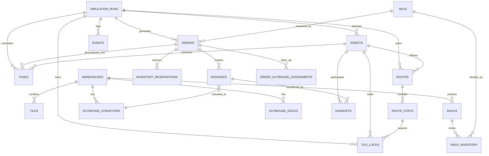
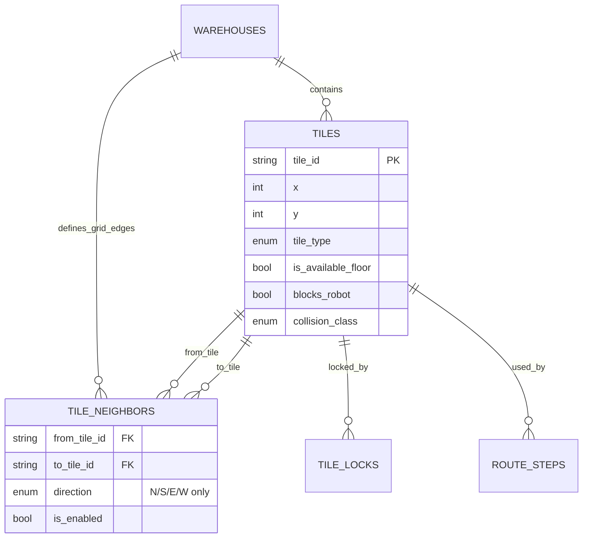
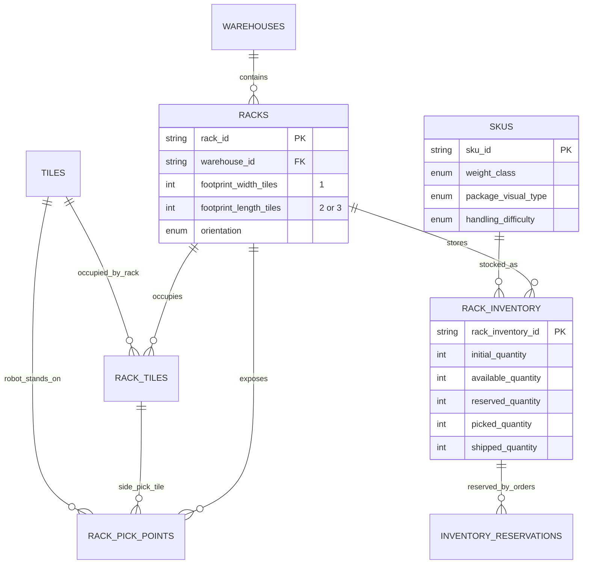
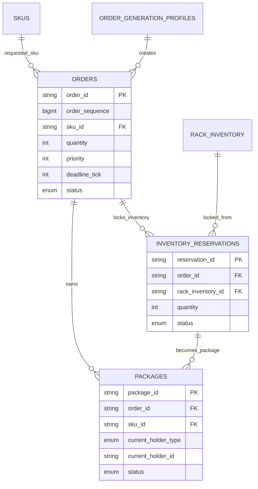
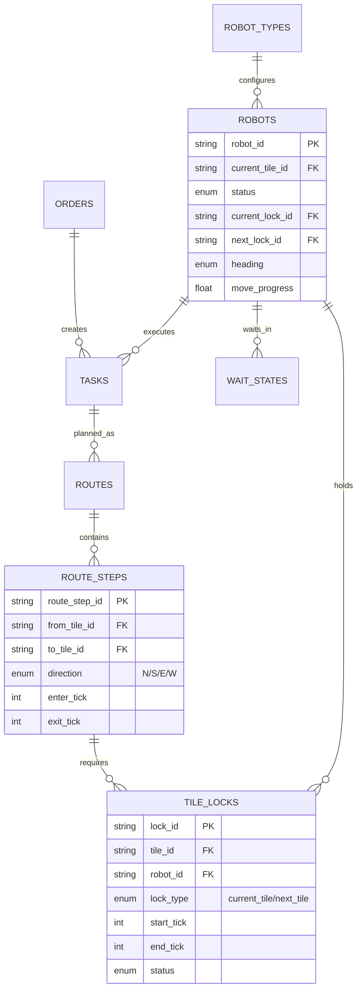
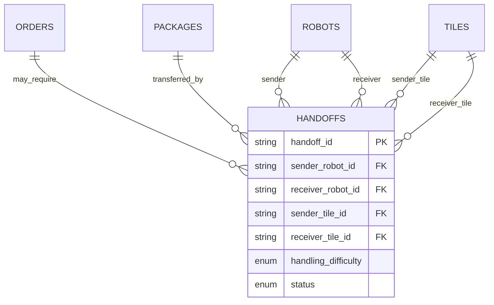
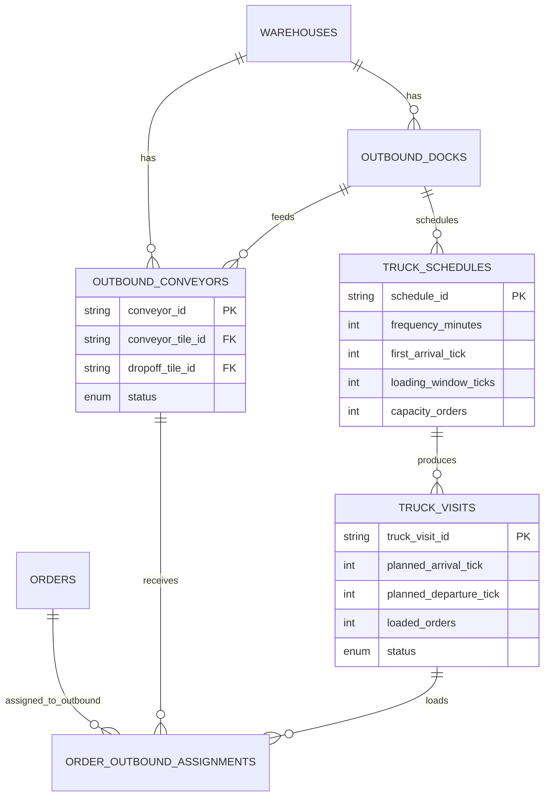
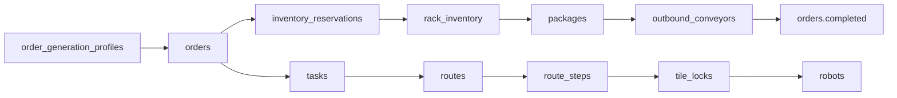

# Warehouse Database Diagrams

这份文档只放数据库关联图，方便快速看清表之间的关系。完整字段定义见 `docs/database_design.md`。

## 1. 总体关系图

## 2. Warehouse 地图与障碍物

关键规则：

- visual 的 isometric 45 度移动来自 `N/S/E/W` 四向网格投影。
- robot 只能进入 `is_available_floor = true` 的 tile。
- rack、conveyor、dock、wall、blocked tile 都是 `blocks_robot = true`。
- `tile_neighbors` 不能连到不可走 tile。

## 3. Rack、Pick Point、SKU、库存

## 4. 订单、锁货、Package

## 5. Robot、Task、Route、Tile Lock

核心关系：

- robot 当前格对应 `current_tile` lock。
- robot 下一格对应 `next_tile` lock。
- 下一格锁不到，就写 `wait_states`。
- `route_steps.direction` 只允许 `N/S/E/W`。

## 6. Robot Handoff

约束：

- `sender_tile_id` 和 `receiver_tile_id` 必须是 `N/S/E/W` 相邻 tile。
- package 同一时间只能在 sender、receiver、conveyor、shipped 之一。

## 7. 出口履带、Dock、车辆

关键规则：

- `conveyor_tile_id` 是履带本体，不可走。
- `dropoff_tile_id` 是机器人站立卸货的 available floor tile。
- order 在 dropoff tile 完成卸货后，warehouse 履约可记为 completed。

## 8. 最小实现关系

第一版只要这条链路跑通，就能支持订单生成、锁货、取货、走路锁格、卸到出口、计算 throughput。
