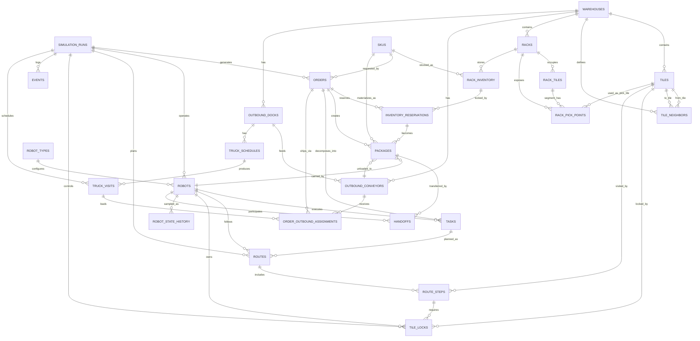
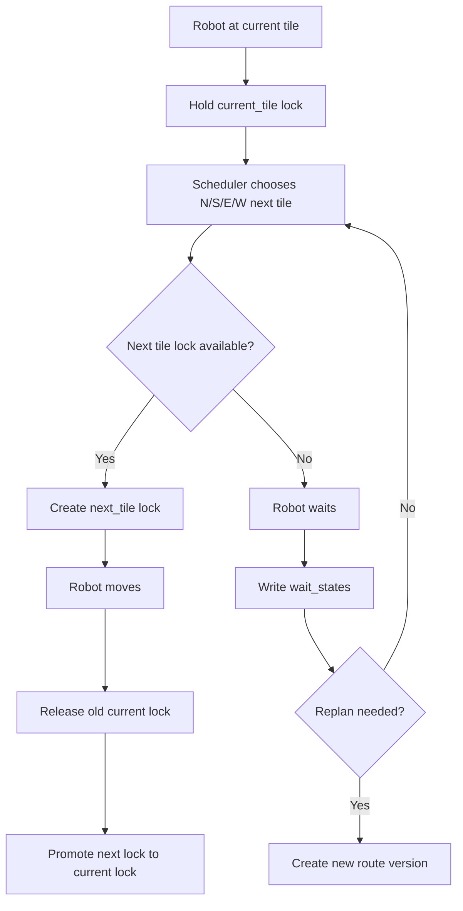
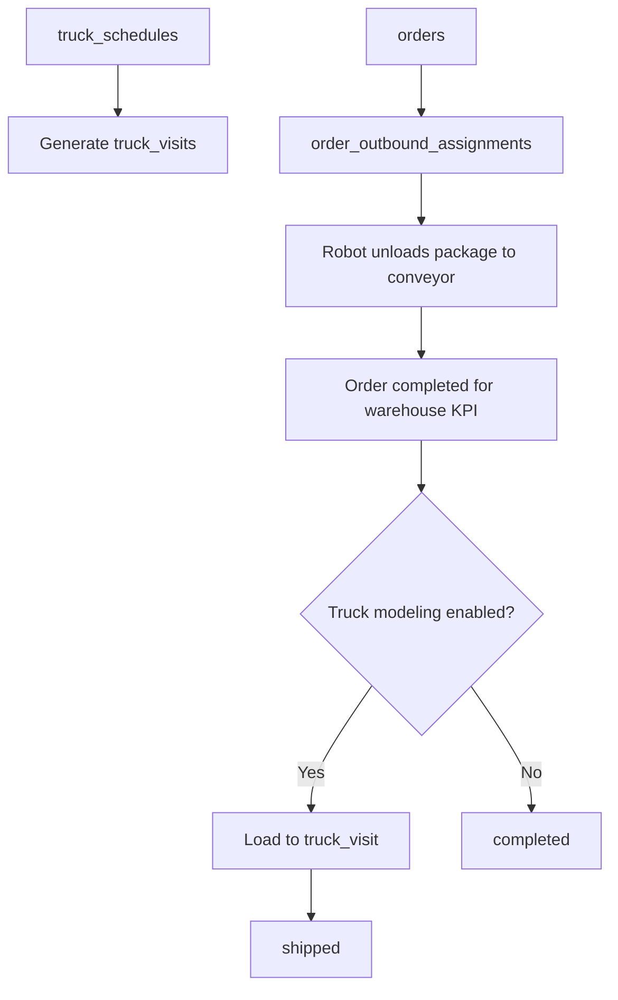

# Warehouse Outbound Entity Relationships

更细的拆分图见 `docs/database_diagrams.md`。

## 1. 总览

这个 ER 设计围绕只出库 warehouse runtime：

```text
Warehouse -> Tile Map -> Rack/SKU Inventory -> Generated Orders -> Robots -> Tile Locks -> Conveyor/Truck -> Completed Orders
```

数据库记录的是状态源：

- 地图在哪里
- rack 在哪里
- rack 侧边哪里能取货
- 哪些 tile 是可行走 available floor
- 哪些 tile 是 rack、出口履带、dock、墙体等碰撞阻挡物
- SKU 有多少
- 订单要什么 SKU、什么时候前完成
- 机器人在哪、拿着什么、处于什么状态
- 哪些 tile 被谁锁住
- 货物是否已经卸到出口履带

throughput、congestion、waiting time 等指标从这些状态和事件派生。

## 2. ER 图



## 3. 核心关系

### Warehouse -> Tiles

- 一个 warehouse 有很多 tiles。
- `(warehouse_id, x, y)` 必须唯一。
- `tile_neighbors` 只允许 `N`, `S`, `E`, `W` 四向连接。
- 机器人路径必须沿 `tile_neighbors` 移动，不能对角线移动。
- visual 用 isometric 投影时，数据层仍然只记录 `N/S/E/W`；画面上的 45 度移动只是投影结果。
- `is_available_floor = true` 是机器人可走地面的唯一来源。
- rack、出口履带、dock、墙体、blocked tile 都必须是 `is_available_floor = false`。

### Tiles -> Collision

- `tiles.collision_class = available_floor` 表示可行走地面。
- `rack_collision` 表示 rack 本体占用 tile。
- `conveyor_collision` 表示出口履带本体，不可进入。
- `dock_collision` 表示车辆或 dock 本体，不可进入。
- `wall_collision` 表示墙体。
- `temporary_blocked` 表示临时阻挡。
- pathfinding、tile lock、route step 都不能把机器人送到非 available floor tile。

### Warehouse -> Racks

- 一个 warehouse 通常有 8 到 16 个 racks。
- 一个 rack 占用多个 rack tiles。
- 当前规则只支持 `1x2` 和 `1x3` rack。
- rack 占用的 tile 不可通行。

### Rack -> Pick Points

- 一个 `1x2` rack 理论上有 4 个侧边 pick points。
- 一个 `1x3` rack 理论上有 6 个侧边 pick points。
- pick point 本质上是 rack 侧边的可站立 tile。
- 如果 rack 靠墙或侧边被阻挡，对应 pick point 标为 `is_available = false`。
- 机器人取货时，必须站在对应 SKU/rack 的可用 pick point 上。

### SKU -> Rack Inventory

- SKU 描述货物类型。
- `weight_class` 决定视觉类型：
  - `light` -> `cardboard_box`
  - `medium` -> `wooden_crate`
  - `heavy` -> `metal_crate`
- `handling_difficulty` 决定取货、交接、卸货时间。
- difficulty 不必和 weight 成正比。
- 只出库场景下，`rack_inventory.initial_quantity` 是上限，库存不会补回去。

### Orders -> Inventory

- 订单由 `order_generation_profiles` 自动生成。
- `order_id` 使用 ULID/UUIDv7 等长字符串，保证长时间高频模拟不重复。
- 订单不记录客户，只记录 warehouse 履约需要的信息。
- 订单锁货后产生 `inventory_reservations`。
- 取货后产生或更新 `packages`。

### Robots -> Tile Locks

- 机器人实时位置在 `robots.current_tile_id`。
- 机器人当前格必须有 `tile_locks.lock_type = current_tile`。
- 机器人要移动到下一格时，必须先拿到 `tile_locks.lock_type = next_tile`。
- 如果下一格锁被别人占用，机器人进入 `waiting_for_tile_lock`，并写入 `wait_states`。
- 同一 tile 同一 tick 区间只能有一个 active lock。

### Robots -> Handoffs

- handoff 必须发生在两个相邻 tile 上。
- sender 和 receiver 都需要处于对应 handoff 状态。
- handoff 耗时由 SKU 的 `handling_difficulty` 和机器人能力共同决定。

### Orders -> Outbound

- 出口履带本体是 `conveyor_collision`，机器人不能走上去。
- 机器人站在 `outbound_conveyors.dropoff_tile_id` 对应的 available floor tile 上，把 package 卸到出口履带。
- 仓库履约完成点是 `unloaded_at_conveyor` 或 `completed`。
- 如果需要模拟车辆班次，订单可继续绑定 `truck_visits`。
- 车辆可以每 30 分钟或 60 分钟到达一次，具体车次在 `truck_visits`。

## 4. 订单生命周期

推荐状态流：

```text
generated
-> pending_inventory
-> inventory_reserved
-> robot_assigned
-> navigating_to_rack
-> picking
-> in_transit
-> waiting_handoff
-> handoff
-> navigating_to_conveyor
-> unloading_at_conveyor
-> completed
```

失败路径：

```text
pending_inventory -> failed_stockout
in_transit -> failed_deadline_missed
any active state -> failed_runtime_error
```

数据库中可以统一用：

```text
failed + failure_reason
```

## 5. 机器人状态模型

建议状态：

```text
idle
ready
assigned
planning_route
navigating
moving
waiting_for_tile_lock
waiting_for_pick_point
picking
carrying
waiting_for_handoff
handoff_sending
handoff_receiving
navigating_to_conveyor
unloading
releasing_package
blocked
error
offline
```

状态设计原则：

- `idle`: 没任务。
- `ready`: 可接任务。
- `planning_route`: scheduler 正在找路。
- `navigating`: 有路线但还没执行到移动 step。
- `moving`: 正在执行 tile step。
- `waiting_for_tile_lock`: 下一个 tile 被锁。
- `waiting_for_pick_point`: rack 取货点被占。
- `picking`: 从 rack 取货。
- `handoff_sending` / `handoff_receiving`: 交接中。
- `unloading`: 在出口履带卸货。

这些状态足够支撑可视化和优化，不需要引入更细的底层动作状态。

## 6. 锁格与避障数据流



## 7. 出口车辆数据流



## 8. 可计算指标来源

| 指标 | 查询来源 |
|---|---|
| throughput | `orders where status = completed` 按 tick 时间窗聚合 |
| active order count | `orders` 当前状态 |
| deadline miss | `completion_tick > deadline_tick` |
| rack depletion | `rack_inventory.initial_quantity - available_quantity` |
| congestion heatmap | `tile_locks` + `wait_states` 按 tile 聚合 |
| robot utilization | `robot_state_history` 或 `robots.status` 时间采样 |
| handoff count | `handoffs.status = completed` |
| conveyor queue | `order_outbound_assignments.status in (...)` |
| truck fill rate | `truck_visits.loaded_orders / capacity_orders` |

## 9. 最重要的不变量

1. 订单 ID 全局唯一。
2. rack 占用 tile 不可通行。
3. pick point 必须是 rack 侧边可站立 tile。
4. 机器人只能走四向邻接 tile。
5. 机器人只能进入 `is_available_floor = true` 的 tile。
6. `tile_neighbors` 不能连接到 rack、出口履带、dock、墙体或 blocked tile。
7. 机器人移动时必须锁当前格和下一格。
8. 同一 tile 的 active lock 不能在 tick 区间重叠。
9. 取货必须在 rack pick point 上进行。
10. handoff 必须发生在相邻机器人之间。
11. package 同一时间只能在 rack、robot、conveyor、shipped 中的一个位置。
12. order 在出口履带旁的 dropoff tile 完成卸货后才算 warehouse completed。
