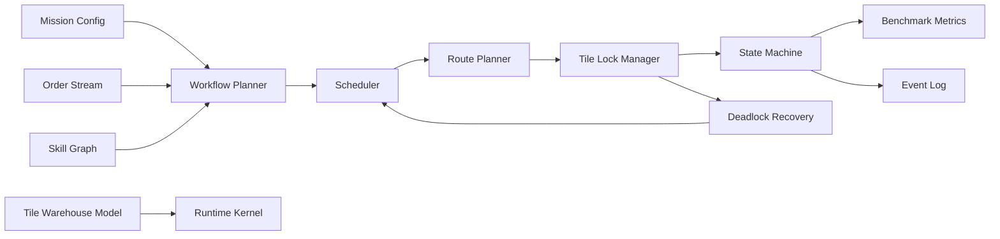

# Warehouse Order Fulfillment Simulator Runtime Design

## Purpose

This runtime is a warehouse optimization simulator for order fulfillment. It models a tile-based warehouse, an order queue, robot executors, movement locks, scheduling decisions, and throughput metrics. It deliberately excludes UI, MuJoCo, low-level robot control, joint control, and physics simulation.

The core question answered by the runtime is:

> Given a warehouse layout, order stream, robot fleet, and skill graph, which scheduling and routing policy completes the most orders per unit time while avoiding lock conflicts and recovering from deadlocks?

## Mission

The mission is to maximize outbound order throughput under operational constraints:

- Orders have `weight`, `difficulty`, and `priority`.
- The warehouse is a discrete grid of tiles.
- Every tile has occupancy state.
- Movement requires locking both the source tile and destination tile.
- The system must support single-robot and multi-robot runs.
- Runtime quality is measured primarily by throughput, with secondary metrics for wait time, deadlocks, replans, and completion latency.

Mission inputs are provided through configuration files:

- `configs/runtime.yaml`: runtime tick rate, lock semantics, event log, and run mode.
- `configs/mission_layout.example.yaml`: tile map, zones, shelves, pick points, conveyors, and docks.
- `configs/skill_graph.yaml`: operational skills and dependencies.
- `configs/scheduler_policy.yaml`: assignment, routing, and deadlock policies.
- `configs/benchmark.yaml`: throughput benchmark settings.

## Runtime Boundary

In scope:

- Tile occupancy and movement locks.
- Order generation and order lifecycle.
- Inventory reservation at the simulator level.
- Skill graph execution as discrete operational steps.
- Robot assignment and route planning.
- Multi-robot lock arbitration.
- Deadlock detection and recovery.
- Throughput benchmarking.
- Deterministic event log for replay and debugging.

Out of scope:

- Robot kinematics or dynamics.
- MuJoCo scene loading or contact simulation.
- Motion control, gait control, arm control, and grasp control.
- UI rendering.
- Real warehouse integration APIs.

## Architecture



The runtime is organized as a deterministic tick loop. Each tick consumes events, advances state machines, attempts lock acquisition, moves robots one tile or skill step at a time, updates order state, and emits metrics.

## Core Components

### Runtime Kernel

Owns the simulation clock and the authoritative state snapshot.

Responsibilities:

- Load configs and schemas.
- Initialize warehouse, orders, robots, inventory, and scheduler.
- Advance the runtime one tick at a time.
- Apply scheduler decisions only through validated commands.
- Emit append-only events.
- Maintain deterministic replay when seed and configs are unchanged.

Tick phases:

1. Ingest newly generated orders.
2. Refresh world model and release expired locks.
3. Advance active skill instances.
4. Ask scheduler for assignments, routes, and recovery actions.
5. Attempt movement lock acquisition.
6. Commit movement and skill transitions.
7. Detect deadlocks and starvation.
8. Update metrics and write events.

### World Model

The world model is tile-based and authoritative. Each tile has static properties and dynamic occupancy.

Static tile fields:

- `tile_id`
- `x`, `y`
- `tile_type`
- `is_traversable`
- `zone_id`
- `neighbors`

Dynamic tile fields:

- `occupant_type`: `none`, `robot`, `reserved`, `blocked`, `maintenance`
- `occupant_id`
- `lock_owner_id`
- `lock_mode`: `none`, `source`, `destination`, `reservation`
- `lock_expires_at_tick`
- `last_updated_tick`

Movement uses four-direction grid edges only: north, south, east, west. Diagonal moves are not valid even if a UI later displays the warehouse isometrically.

### Tile Lock Manager

Movement locks both source and destination tiles. The lock manager prevents conflicting movements and makes arbitration observable.

Lock request:

```text
request_id
robot_id
source_tile_id
destination_tile_id
route_id
priority
requested_at_tick
expires_at_tick
```

Lock rules:

- A robot must own a valid source tile lock and destination tile lock before moving.
- Source and destination locks are acquired atomically.
- A failed lock request does not partially reserve either tile.
- Locks expire if the robot does not commit movement within the configured TTL.
- A robot may not enter a tile whose dynamic occupancy is not empty or self-owned.
- A robot may not move from a tile it does not occupy.

Atomic acquisition prevents the classic case where two robots each hold their source tile and wait forever for the other's destination tile.

### Order Manager

The order manager owns the queue and order lifecycle.

Order properties:

- `order_id`
- `sku_id`
- `quantity`
- `weight`
- `difficulty`
- `priority`
- `creation_tick`
- `deadline_tick`
- `status`

Derived scheduling fields:

- `age_ticks`
- `slack_ticks = deadline_tick - current_tick`
- `difficulty_cost`
- `weight_cost`
- `priority_score`
- `estimated_completion_ticks`

The runtime supports synthetic order generation for benchmarking and externally supplied orders for fixed test cases.

### Workflow Planner

The workflow planner decomposes an order into operational tasks. A standard order expands into:

```text
reserve_inventory -> assign_robot -> route_to_pick -> pick -> route_to_dropoff -> unload -> complete_order
```

For multi-robot workflows, the planner may add handoff tasks:

```text
reserve_inventory -> assign_picker -> route_to_pick -> pick -> route_to_handoff -> handoff -> route_to_dropoff -> unload
```

Workflow planning is declarative. The planner chooses skill graph nodes and binds task parameters; it does not directly move robots.

### Skill Runtime

A skill instance is a discrete runtime object with preconditions, locks, duration, effects, and failure handling.

Example skill instance:

```yaml
skill_instance_id: si_pick_00042
skill_id: pick_from_rack
order_id: ord_00042
robot_id: r01
status: running
inputs:
  pick_tile_id: T_07_04
  rack_id: rack_A_12
locks:
  required_tiles: [T_07_04]
started_at_tick: 320
expected_complete_at_tick: 326
```

Skills are not low-level robotics primitives. They are warehouse operations such as route, pick, load, handoff, unload, and pack.

### Scheduler

The scheduler decides which robot should execute which task and when.

Inputs:

- Current robot states.
- Order queue and priorities.
- Tile occupancy and lock wait graph.
- Skill graph readiness.
- Route estimates and congestion estimates.
- Benchmark objective.

Outputs:

- Assignment commands.
- Route planning requests.
- Lock acquisition requests.
- Wait/yield commands.
- Replan commands.
- Deadlock recovery commands.

Default objective:

```text
maximize completed_orders / simulated_hour
```

Secondary tie breakers:

1. Avoid SLA misses.
2. Reduce average completion time.
3. Minimize lock wait time.
4. Minimize route congestion.
5. Balance robot utilization.

### Route Planner

The route planner operates over traversable tile neighbors. It returns a route as a sequence of tile IDs.

Default route cost:

```text
edge_cost = 1
          + congestion_penalty(tile)
          + reservation_penalty(tile, time_window)
          + turn_penalty
          + load_penalty(weight)
```

Single-robot mode can use shortest path without reservation windows. Multi-robot mode should use time-aware reservations or repeated replanning so that planned paths reflect occupancy and lock contention.

### Deadlock Detector

The detector builds a wait-for graph from lock requests:

```text
Robot A waits for tile T
Tile T is occupied or locked by Robot B
Robot A waits for Robot B
```

A cycle indicates deadlock. Long waits without a cycle indicate starvation or congestion.

Detection signals:

- Lock wait cycle.
- Head-on swap attempt between adjacent robots.
- Corridor standstill above threshold.
- Repeated lock denial for the same robot and same destination.
- No completed order progress for a configured tick window.

### Deadlock Recovery

Recovery is handled in escalating stages:

1. Yield: lower-priority robot releases route intent and waits.
2. Backoff: one robot moves to a safe neighboring tile or buffer tile.
3. Reroute: affected robots receive new routes with temporary avoid tiles.
4. Priority boost: old or high-priority orders get lock priority boost.
5. Local evacuation: clear a corridor or choke point through staged moves.
6. Runtime fail-safe: pause assignment of new tasks until the blocked component is cleared.

Recovery must emit events so benchmark runs can report deadlock count and recovery cost.

## Single-Robot Mode

Single-robot mode uses the same architecture with simplified scheduling:

- No inter-robot lock contention.
- Source/destination locking still applies for consistency.
- Scheduler only chooses next order and route.
- Deadlock detection focuses on blocked tiles and invalid routes.

Single-robot mode is useful for validating order decomposition, throughput baseline, and layout reachability.

## Multi-Robot Mode

Multi-robot mode enables contention, arbitration, and deadlock recovery.

Additional runtime requirements:

- Lock requests are prioritized and deterministic.
- Robots cannot swap tiles in one tick unless a configured swap protocol is explicitly enabled. The default is no swap.
- Narrow corridors need buffer tiles or one-way lane policies.
- Scheduler tracks utilization and queue pressure.
- Deadlock recovery can temporarily override normal assignment priority.

## Scheduler Policy

The baseline scheduler is a priority-weighted earliest-finish policy.

Order score:

```text
score(order, robot) =
    priority_weight * normalized_priority
  + urgency_weight * inverse_slack
  - travel_weight * estimated_travel_ticks
  - handling_weight * difficulty_cost
  - weight_weight * payload_penalty
  - congestion_weight * route_congestion
```

A robot can accept an order when:

- It is idle or ready.
- It has sufficient payload capacity.
- It has required skill compatibility.
- A route exists to the pick point and outbound point.
- The target order is not already assigned.

## Runtime Commands

All state changes are made through commands. This keeps scheduling logic separate from state mutation.

Command types:

- `CreateOrder`
- `ReserveInventory`
- `AssignTask`
- `PlanRoute`
- `RequestTileMove`
- `CommitTileMove`
- `StartSkill`
- `CompleteSkill`
- `FailSkill`
- `ReleaseLock`
- `ReplanRoute`
- `RecoverDeadlock`
- `CompleteOrder`

Commands are validated against the current state before being committed.

## Event Log

The runtime emits append-only events for replay and benchmarking.

Event types:

- `order.created`
- `order.assigned`
- `order.completed`
- `robot.assigned`
- `robot.lock_wait`
- `robot.moved`
- `skill.started`
- `skill.completed`
- `route.planned`
- `route.replanned`
- `deadlock.detected`
- `deadlock.recovered`
- `metric.throughput_updated`

Event records should include:

- `run_id`
- `tick`
- `event_type`
- `entity_type`
- `entity_id`
- `payload`

## Benchmark Metrics

Primary metric:

```text
throughput = completed_orders / simulated_hour
```

Secondary metrics:

- `completed_orders`
- `pending_orders`
- `active_orders`
- `orders_per_1000_ticks`
- `average_completion_ticks`
- `p50_completion_ticks`
- `p95_completion_ticks`
- `average_wait_ticks`
- `average_lock_wait_ticks`
- `deadlock_count`
- `deadlock_recovery_ticks`
- `replan_count`
- `robot_utilization_pct`
- `tile_congestion_hotspots`
- `sla_miss_count`

A benchmark run is valid only if all completed orders pass lifecycle invariants and no robot violates tile occupancy or movement lock rules.

## Runtime Invariants

The simulator must enforce these invariants on every tick:

- At most one robot occupies a tile.
- A robot's `current_tile` must match the tile occupancy map.
- A robot cannot move to a non-neighbor tile.
- A robot cannot move into a non-traversable tile.
- A robot cannot move without source and destination locks.
- A tile lock has at most one owner.
- Completed orders have completion ticks and outbound destination records.
- A robot cannot carry more than its payload capacity.
- Inventory reserved for an order cannot be reserved by another active order.
- Deadlock recovery must not bypass tile occupancy validation.

## Implementation Modules

Recommended package structure for future code:

```text
warehouse_runtime/
  config/
    loader.py
    validation.py
  model/
    tile.py
    warehouse.py
    order.py
    robot.py
    inventory.py
  runtime/
    kernel.py
    commands.py
    events.py
    locks.py
    state_machine.py
  planning/
    workflow_planner.py
    skill_graph.py
    route_planner.py
  scheduling/
    scheduler.py
    scoring.py
    deadlock.py
    recovery.py
  benchmark/
    metrics.py
    runner.py
```

## Deliverable Fit

This architecture supports a hackathon submission because it gives judges a clean chain:

```text
Mission -> Workflow -> Skill Graph -> Runtime -> Scheduler -> State Machine -> Throughput
```

It also provides a practical path from documentation to implementation without depending on UI, MuJoCo, or robot control.
