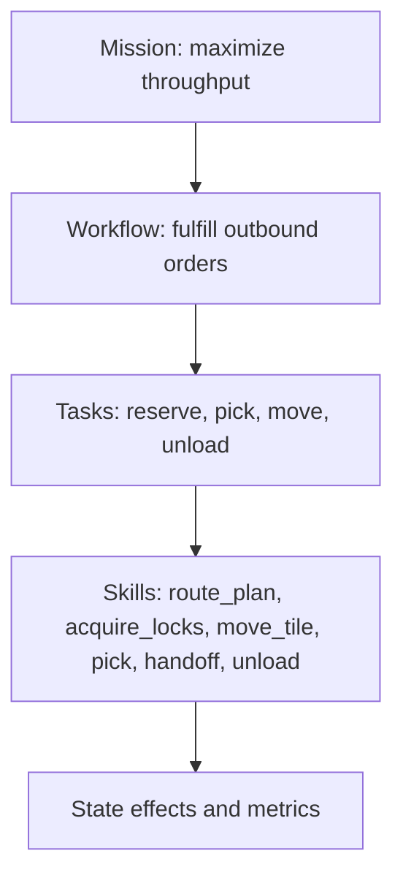
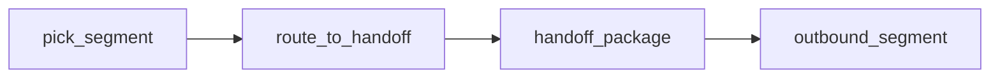
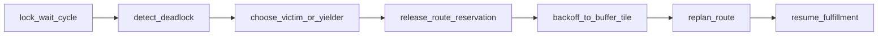

# Warehouse Fulfillment Skill Graph Design

## Purpose

The skill graph defines the executable warehouse operations used by the runtime. It is not a robotics motion graph. Each node represents an operational skill with discrete preconditions, runtime locks, effects, metrics, and failure handling.

The graph turns a mission-level order into a sequence or partial order of warehouse tasks that can be scheduled across one robot or many robots.

## Design Goals

- Keep the graph warehouse-optimization focused.
- Represent both single-robot and multi-robot fulfillment.
- Make dependencies explicit and inspectable.
- Allow the scheduler to choose among valid skills and routes.
- Track throughput impact for each skill.
- Support deadlock-aware replanning without changing order semantics.

## Skill Graph Levels



The graph is declarative. The runtime instantiates graph nodes as skill instances when their preconditions are satisfied.

## Core Workflow

A standard single-robot order uses this workflow:

```mermaid
flowchart LR
    A["order_created"] --> B["reserve_inventory"]
    B --> C["assign_robot"]
    C --> D["plan_route_to_pick"]
    D --> E["move_to_pick"]
    E --> F["pick_from_rack"]
    F --> G["plan_route_to_outbound"]
    G --> H["move_to_outbound"]
    H --> I["unload_to_conveyor"]
    I --> J["complete_order"]
```



A multi-robot workflow can insert a handoff when it improves throughput or avoids congestion:



## Node Contract

Every skill node has the same contract:

```yaml
skill_id: pick_from_rack
category: handling
inputs: []
preconditions: []
locks: []
duration_model: {}
effects: []
failure_modes: []
metrics: []
```

Required fields:

- `skill_id`: stable identifier.
- `category`: `planning`, `movement`, `handling`, `coordination`, `recovery`, or `completion`.
- `inputs`: data required to instantiate the skill.
- `preconditions`: predicates over runtime state.
- `locks`: resources required while the skill runs.
- `duration_model`: deterministic or distribution-based tick duration.
- `effects`: state changes applied on completion.
- `failure_modes`: expected failure conditions.
- `metrics`: counters or timers updated by the skill.

## Skill Categories

### Planning Skills

Planning skills do not move robots. They produce assignments, route candidates, or reservations.

- `reserve_inventory`
- `assign_robot`
- `plan_route`
- `select_handoff_point`
- `replan_route`

### Movement Skills

Movement skills operate on tile paths and locks.

- `acquire_tile_locks`
- `move_one_tile`
- `follow_route`
- `wait_for_tile`
- `yield_to_robot`

### Handling Skills

Handling skills represent warehouse operations, not low-level manipulation.

- `pick_from_rack`
- `load_package`
- `handoff_package`
- `unload_to_conveyor`
- `pack_order`

### Recovery Skills

Recovery skills are invoked by the scheduler or deadlock recovery module.

- `detect_deadlock`
- `release_route_reservation`
- `backoff_to_buffer_tile`
- `reroute_around_blockage`
- `evacuate_corridor`

### Completion Skills

Completion skills close order state and update metrics.

- `mark_order_completed`
- `mark_order_failed`
- `update_throughput_metrics`

## Baseline Skill Nodes

### `reserve_inventory`

Purpose: bind an order to an available SKU location.

Preconditions:

- Order status is `generated` or `pending_inventory`.
- Required SKU quantity exists.
- Inventory is not already reserved.

Effects:

- Create inventory reservation.
- Set order status to `inventory_reserved`.
- Attach rack or pick-point target.

Failure modes:

- `stockout`
- `rack_blocked`

### `assign_robot`

Purpose: assign a capable robot to a ready order or task.

Preconditions:

- Order has reserved inventory.
- Robot is `idle` or `ready`.
- Robot payload capacity is at least order weight.
- Robot supports required handling difficulty.

Effects:

- Set `assigned_robot_id` on order.
- Set robot status to `assigned`.
- Create task instance.

Failure modes:

- No capable robot.
- Order already assigned.

### `plan_route`

Purpose: produce a route over traversable tiles.

Preconditions:

- Start tile and target tile are valid.
- Target tile is reachable.
- Robot is not offline.

Effects:

- Attach route to robot or task.
- Estimate travel ticks.
- Estimate congestion risk.

Failure modes:

- No route found.
- Target blocked.

### `acquire_tile_locks`

Purpose: atomically lock source and destination tile for one movement step.

Preconditions:

- Robot occupies source tile.
- Destination is a cardinal neighbor.
- Destination tile is traversable.
- Neither tile has a conflicting lock.

Effects:

- Assign lock owner for source and destination.
- Set robot status to `moving` or `waiting_for_tile_lock`.

Failure modes:

- Destination occupied.
- Lock conflict.
- Deadlock risk.

### `move_one_tile`

Purpose: commit a one-tile movement after locks are acquired.

Preconditions:

- Robot owns source and destination locks.
- Destination remains empty.
- Source occupancy matches robot.

Effects:

- Clear source occupancy.
- Set destination occupancy to robot.
- Update robot current tile.
- Release source lock after commit.
- Keep or release destination lock according to lock TTL policy.

Failure modes:

- Lock expired.
- Occupancy mismatch.

### `follow_route`

Purpose: repeatedly execute tile movement along a route.

Preconditions:

- Robot has active route.
- Next route step is valid.

Effects:

- Advance route cursor.
- Emit movement events.
- Mark route complete when target is reached.

Failure modes:

- Repeated lock denial.
- Route invalidated by blockage.

### `pick_from_rack`

Purpose: pick reserved inventory from a rack or pick point.

Preconditions:

- Robot is at the required pick tile.
- Order has inventory reservation.
- Robot has payload capacity.
- Pick point is not occupied by another handling skill.

Effects:

- Transfer SKU from reserved inventory to robot carried package.
- Set order status to `picking` then `in_transit`.
- Increase robot carried weight.

Failure modes:

- Reservation missing.
- Weight exceeds payload.
- Pick point busy.

### `handoff_package`

Purpose: transfer a package between two robots.

Preconditions:

- Sender carries package.
- Receiver is empty or has capacity.
- Robots are on adjacent handoff-compatible tiles.
- Both robots are assigned to the handoff task.
- Handoff point is not blocked.

Effects:

- Move package ownership from sender to receiver.
- Update order assigned robot if receiver owns outbound segment.
- Release sender to next task or idle state.

Failure modes:

- Partner not adjacent.
- Receiver capacity exceeded.
- Handoff timeout.

### `unload_to_conveyor`

Purpose: unload the package at the assigned outbound tile.

Preconditions:

- Robot carries package for order.
- Robot is at outbound tile or adjacent unload tile.
- Conveyor or dock has capacity.

Effects:

- Clear robot carried package.
- Set order status to `completed`.
- Set completion tick.
- Update throughput metrics.

Failure modes:

- Conveyor blocked.
- Wrong package.
- Deadline missed if configured as hard failure.

## Dependency Model

Dependencies are expressed as graph edges with optional conditions.

Edge types:

- `requires`: target cannot start until source completes.
- `enables`: source completion makes target eligible.
- `alternative`: scheduler may choose one of several nodes.
- `recovery`: edge only active during deadlock or failure handling.
- `metric`: source updates a metric node.

Example:

```yaml
edges:
  - from: reserve_inventory
    to: assign_robot
    type: requires
  - from: pick_from_rack
    to: handoff_package
    type: alternative
    condition: multi_robot_handoff_enabled
  - from: acquire_tile_locks
    to: reroute_around_blockage
    type: recovery
    condition: repeated_lock_denial
```

## Runtime Instantiation

A graph node becomes a skill instance when the workflow planner binds it to concrete entities.

Example:

```yaml
skill_instance_id: si_000187
skill_id: plan_route
order_id: ord_000041
robot_id: r03
status: queued
inputs:
  start_tile_id: T_02_04
  target_tile_id: T_10_06
```

Skill instance states:

- `queued`
- `ready`
- `running`
- `waiting_lock`
- `waiting_resource`
- `completed`
- `failed`
- `cancelled`

## Scheduler Integration

The scheduler reads ready skill instances and chooses which to run. Skill graph readiness does not imply immediate execution; execution still depends on robot availability, lock state, route feasibility, and benchmark objective.

Scheduler uses these skill fields:

- `priority_contribution`
- `estimated_duration_ticks`
- `required_robot_capabilities`
- `required_tile_locks`
- `congestion_risk`
- `deadline_impact`

## Deadlock-Aware Skills

Recovery skills are part of the skill graph so deadlock recovery remains auditable.

Deadlock recovery path:



Recovery effects must not directly edit occupancy. They produce commands that still pass through the lock manager and state machine.

## Throughput Attribution

Each skill can report contribution to throughput and delay:

- Queue wait before skill start.
- Skill duration.
- Lock wait duration.
- Replan count while skill is active.
- Failure or recovery count.
- Downstream completion impact.

This allows benchmark reports to explain whether throughput is limited by assignment, routing, picking, unloading, or deadlock recovery.

## Graph Validation Rules

The graph is valid when:

- Every order completion path includes inventory reservation, movement to pick, pick, movement to outbound, unload, and completion.
- Every movement path includes lock acquisition before movement commit.
- Every skill's effects are allowed by the state machine.
- Recovery paths return to a normal workflow node or fail the order explicitly.
- Multi-robot handoff paths include sender and receiver ownership transitions.
- No graph cycle can run indefinitely without a wait, recovery, completion, or failure condition.

## Recommended Config

The canonical graph lives in:

```text
configs/skill_graph.yaml
```

That file should be treated as the source of truth for simulator execution. This document explains the design and validation rules behind it.
