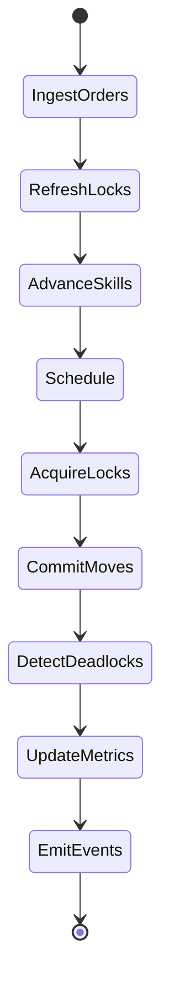
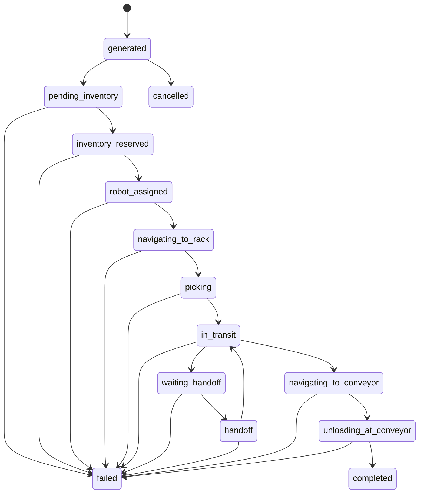
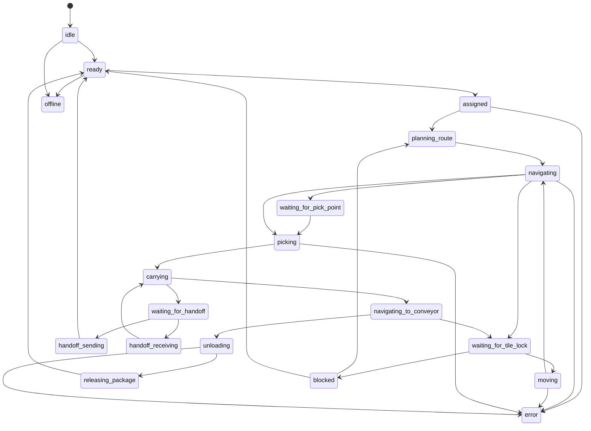
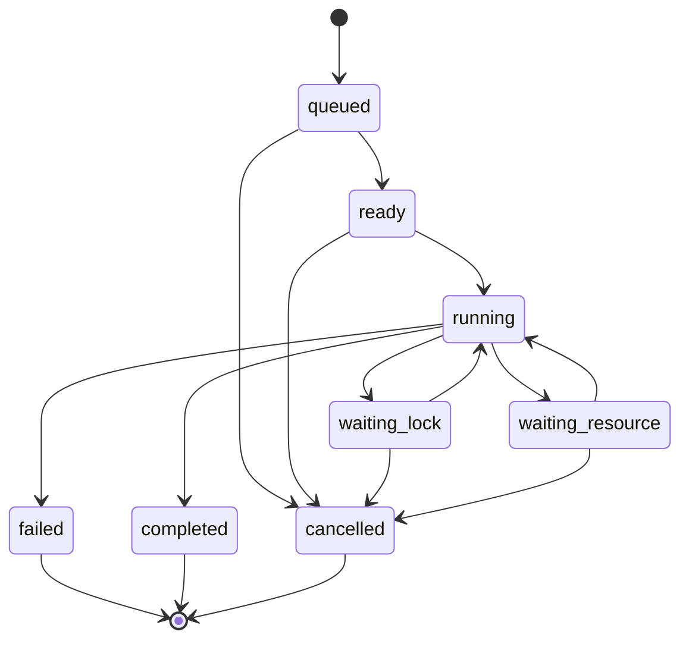
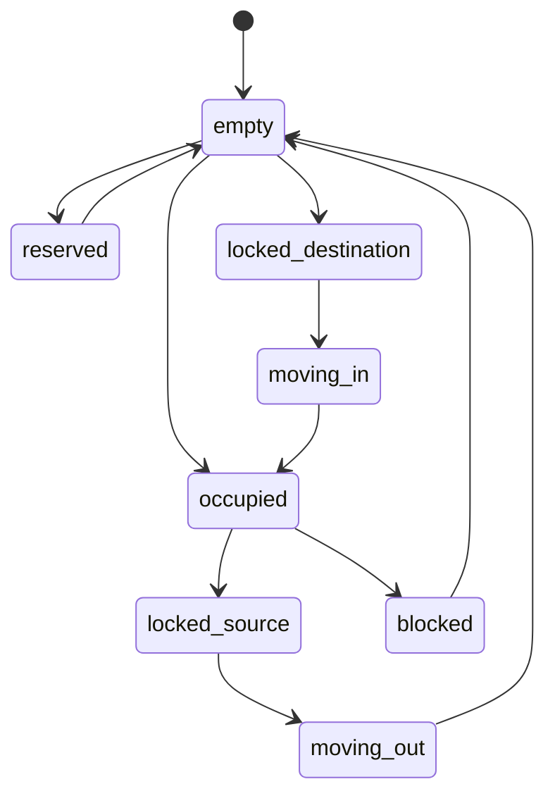
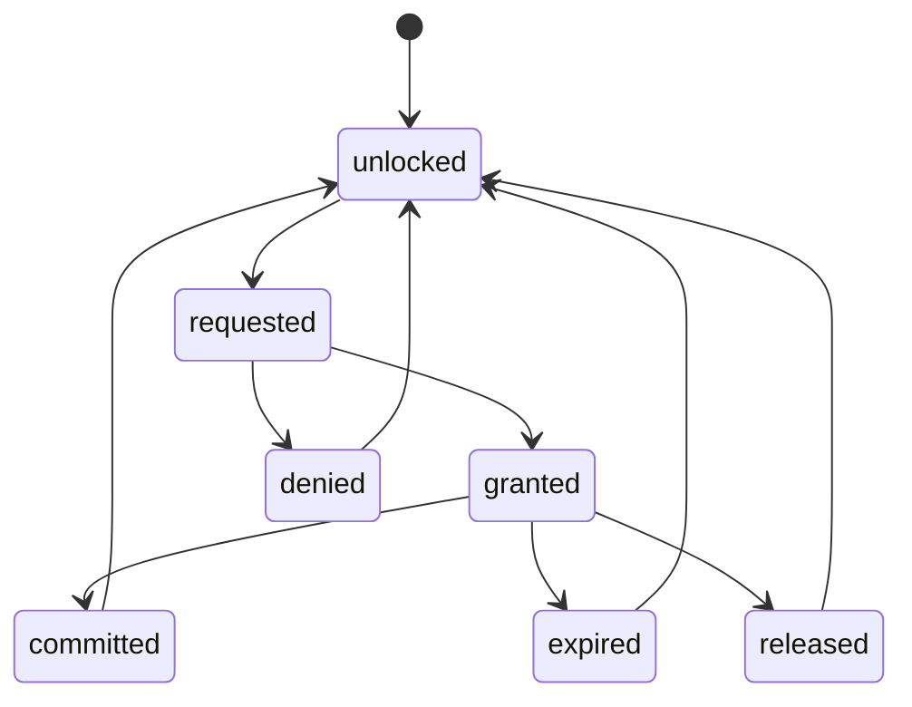
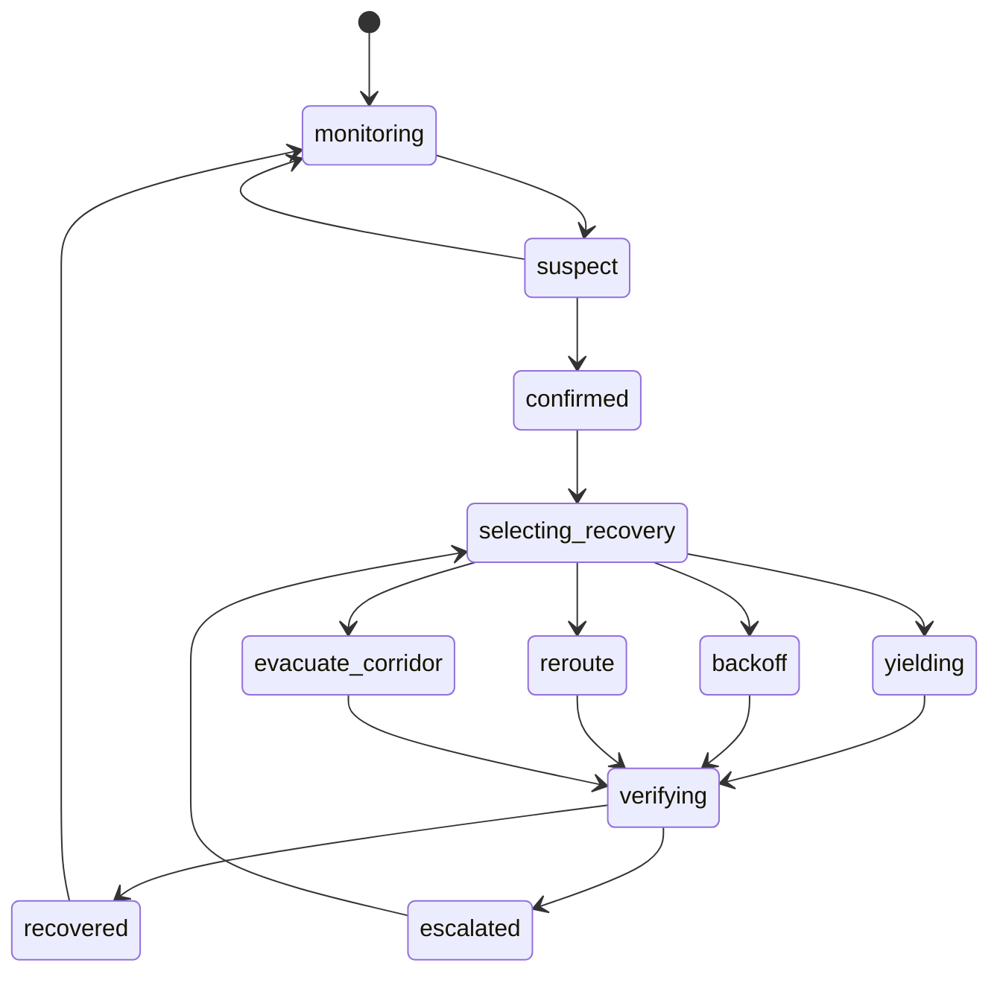
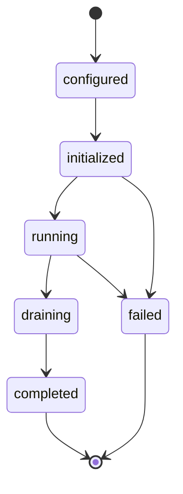

# Warehouse Runtime State Machine

## Purpose

This document defines the state machines for orders, robots, skills, tile locks, and deadlock recovery in the Warehouse Order Fulfillment Simulator.

The runtime is event-driven but deterministic. Every transition is caused by a validated command during a simulation tick.

## State Machine Scope

State machines cover:

- Order lifecycle.
- Robot executor lifecycle.
- Skill instance lifecycle.
- Tile occupancy and lock lifecycle.
- Deadlock detection and recovery lifecycle.
- Benchmark run lifecycle.

They do not cover low-level robot control, MuJoCo simulation, UI state, or physical sensor state.

## Runtime Tick State

Each tick follows this phase order:

Within a tick, state changes are committed only after validation. Failed commands emit rejection events and leave authoritative state unchanged.

## Order State Machine

### Order States

`generated`: Order exists but has not entered inventory allocation.

`pending_inventory`: Runtime is trying to reserve stock.

`inventory_reserved`: SKU and pick location are reserved.

`robot_assigned`: A robot or robot chain has been assigned.

`navigating_to_rack`: Assigned robot is moving toward pick location.

`picking`: Handling skill is active at pick point.

`in_transit`: Package is carried by a robot.

`waiting_handoff`: Order is waiting for handoff partner positioning.

`handoff`: Package transfer between robots is active.

`navigating_to_conveyor`: Robot is moving toward outbound destination.

`unloading_at_conveyor`: Unload skill is active.

`completed`: Package reached outbound destination and throughput counter is updated.

`failed`: Order cannot complete under current rules.

`cancelled`: Order was removed intentionally.

### Order Transition Guards

- `generated -> pending_inventory`: order enters active queue.
- `pending_inventory -> inventory_reserved`: inventory reservation succeeds.
- `inventory_reserved -> robot_assigned`: scheduler assigns capable robot.
- `robot_assigned -> navigating_to_rack`: route to pick point exists.
- `navigating_to_rack -> picking`: robot reaches pick tile.
- `picking -> in_transit`: package is loaded onto robot.
- `in_transit -> waiting_handoff`: scheduler selects handoff workflow.
- `handoff -> in_transit`: package ownership transfers to receiver.
- `in_transit -> navigating_to_conveyor`: outbound route begins.
- `navigating_to_conveyor -> unloading_at_conveyor`: robot reaches unload tile.
- `unloading_at_conveyor -> completed`: package is accepted by outbound point.

## Robot State Machine

### Robot States

`idle`: Robot is inactive but available.

`ready`: Robot can accept assignment.

`assigned`: Scheduler has bound robot to a task.

`planning_route`: Route planner is producing or refreshing path.

`navigating`: Robot has route and is stepping through it.

`waiting_for_tile_lock`: Robot wants to move but cannot acquire source/destination locks.

`moving`: Robot owns movement locks and is committing a tile move.

`waiting_for_pick_point`: Robot is at or near pick zone but the handling point is busy.

`picking`: Pick skill is running.

`carrying`: Robot holds a package.

`waiting_for_handoff`: Robot waits for partner robot to reach adjacent handoff tile.

`handoff_sending`: Robot is sending package to partner.

`handoff_receiving`: Robot is receiving package from partner.

`navigating_to_conveyor`: Robot is carrying package toward outbound destination.

`unloading`: Unload skill is running.

`releasing_package`: Runtime clears carried package and updates order state.

`blocked`: Robot is paused by congestion, deadlock risk, or invalid route.

`error`: Robot state invariant failed.

`offline`: Robot is unavailable for scheduling.

### Robot Transition Guards

- A robot can enter `moving` only if it owns locks for source and destination tiles.
- A robot can enter `picking` only if the assigned order has reserved inventory and the robot is at the pick tile.
- A robot can enter `carrying` only if package weight is within payload capacity.
- A robot can enter `handoff_sending` only if receiver is adjacent and compatible.
- A robot can enter `unloading` only if it carries the package and is at a valid outbound tile.
- A robot exits `blocked` only through scheduler recovery or successful replanning.

## Skill Instance State Machine

### Skill State Rules

- `queued`: Created by workflow planner but dependencies are not complete.
- `ready`: Dependencies and preconditions are satisfied.
- `running`: Runtime is applying skill duration and effects.
- `waiting_lock`: Skill is blocked by tile or resource lock.
- `waiting_resource`: Skill is blocked by robot, inventory, conveyor, or handoff partner.
- `completed`: Effects are committed.
- `failed`: Failure reason is recorded.
- `cancelled`: Runtime no longer needs the skill instance.

A skill cannot commit effects unless its preconditions are still true at completion tick.

## Tile Occupancy State Machine

### Occupancy States

`empty`: Tile is traversable and unoccupied.

`reserved`: Tile is reserved for a future route window but not hard locked.

`occupied`: Tile contains one robot.

`locked_source`: Occupied tile is locked as movement source.

`locked_destination`: Empty tile is locked as movement destination.

`moving_out`: Robot is leaving source tile during commit.

`moving_in`: Robot is entering destination tile during commit.

`blocked`: Tile is temporarily unavailable.

## Tile Lock State Machine

### Lock Rules

- Lock acquisition for source and destination is atomic.
- A granted source lock requires the requesting robot to occupy source tile.
- A granted destination lock requires destination tile to be empty and traversable.
- A denied lock must include a reason: `occupied`, `locked`, `not_neighbor`, `not_traversable`, `deadlock_risk`, or `expired_route`.
- Expired locks are released before scheduler decisions in the next tick.

## Deadlock Recovery State Machine

### Deadlock States

`monitoring`: No active deadlock; detector watches wait graph.

`suspect`: A robot or group has exceeded wait threshold.

`confirmed`: A wait-for cycle or standstill condition is confirmed.

`selecting_recovery`: Runtime chooses recovery action.

`yielding`: One or more robots wait and release route intent.

`backoff`: Selected robot moves to buffer tile.

`reroute`: Scheduler creates new route avoiding contested tiles.

`evacuate_corridor`: Runtime clears a constrained corridor through staged moves.

`verifying`: Runtime checks whether progress resumed.

`escalated`: Previous recovery did not work; stronger action required.

`recovered`: Blocking cycle is gone and at least one affected robot progressed.

### Recovery Selection

Recovery chooses an action using these priorities:

1. Protect higher-priority and older orders.
2. Prefer moving unloaded robots before loaded robots.
3. Prefer shortest backoff to a buffer tile.
4. Avoid blocking outbound conveyors and pick points.
5. Avoid repeating a failed recovery action for the same cycle.

## Benchmark Run State Machine

`configured`: Config files are loaded.

`initialized`: Warehouse, robots, orders, and metrics are ready.

`running`: Runtime is generating or ingesting orders.

`draining`: No new orders are generated; active orders finish or fail.

`completed`: Benchmark window ended and metrics are finalized.

`failed`: Runtime invariant or config validation failed.

## Global Invariants

The state machine must enforce:

- One robot per tile maximum.
- A robot exists on exactly one tile unless offline before initialization.
- Source and destination movement locks are held by the moving robot.
- Destination tile is empty before movement commit.
- Robot route steps are cardinal neighbors.
- Order assignment references an existing robot.
- Carried package references an active order.
- Completed order has an unload tick and completion tick.
- Failed order has a failure reason.
- Recovery commands pass through normal lock and occupancy validation.

## Command Validation Matrix

| Command | Required current state | Result state |
| --- | --- | --- |
| `ReserveInventory` | order `pending_inventory` | order `inventory_reserved` |
| `AssignTask` | order `inventory_reserved`, robot `ready` | order `robot_assigned`, robot `assigned` |
| `PlanRoute` | robot `assigned` or `blocked` | robot `planning_route` then `navigating` |
| `RequestTileMove` | robot `navigating`, valid neighbor | lock `requested` |
| `CommitTileMove` | locks `granted` | robot tile updated |
| `StartSkill` | skill `ready` | skill `running` |
| `CompleteSkill` | skill `running` | skill `completed` |
| `ReplanRoute` | robot `blocked` or route invalid | robot `planning_route` |
| `RecoverDeadlock` | deadlock `confirmed` | recovery active |
| `CompleteOrder` | order `unloading_at_conveyor` | order `completed` |

## Failure Handling

Failures should be explicit and measurable.

Failure categories:

- Config validation failure.
- No route found.
- Inventory unavailable.
- Robot capacity mismatch.
- Deadline missed.
- Lock timeout.
- Deadlock recovery exhaustion.
- Runtime invariant violation.

Recoverable failures should create recovery or replan skills. Nonrecoverable failures should mark the affected order failed and release its reservations.
