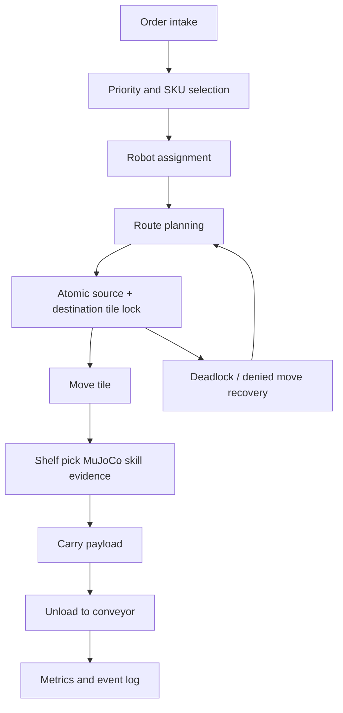

# Project Name

Agentic Warehouse Quadbot Fulfillment Simulator

# Overview

This project is a warehouse-order-fulfillment simulation built for the FFAI Robothon 2026 judging rubric. It combines a discrete multi-robot warehouse runtime with MuJoCo evidence clips for the low-level AEGIS quadruped actions that the runtime assumes.

The project is intentionally layered:

Mission -> Workflow -> Skill Graph -> Runtime -> Multi-Agent Warehouse Optimization -> MuJoCo Evidence -> Mission Control UI

# Judge-Facing Thesis

This submission is best read as a warehouse optimization benchmark with MuJoCo-backed robot skills, not as a single action demo. A single relay or handoff proves one local physical event. This project measures whether a shared warehouse stays productive when 9 quadrupeds compete for orders, racks, tile locks, priority, and narrow aisles over long simulated horizons.

The important claim is measurable: planner-off versus local-planner baselines show throughput uplift, wait-time reduction, and zero movement safety violations across generated load profiles and the 54-scenario accelerated stress benchmark.

# Problem Statement

Warehouse throughput depends on more than one robot successfully moving a parcel. A practical system must coordinate many robots, reserve space, avoid rack collisions, handle congestion, prioritize orders, and still prove that low-level robot actions are physically plausible. This submission targets that full stack while keeping MuJoCo focused on physical validation.

# System-Level Difficulty

The hard part is not only whether one robot can pick one parcel. The hard part is whether many robots can make simultaneous decisions inside the same constrained warehouse. Every assignment consumes a robot, every route consumes future tiles, every wait increases order age, and every shortcut can create congestion for another robot.

This makes the benchmark closer to warehouse traffic control than to a single manipulation clip. The runtime must keep four things true at the same time: orders keep completing, urgent work is not starved, robots do not collide or overlap locks, and the system still improves throughput under load.

# Robot Platform

The robot platform is the Faraday Future AEGIS quadruped using `assets/Aegis/urdf/Aegis_mujoco.urdf`. The warehouse version adds a BASE_LINK-mounted basket and a Futurist-derived six-axis front manipulator with base yaw, shoulder pitch, elbow pitch, wrist pitch, wrist roll, tool yaw, and two slide-joint gripper fingers.

# Environment

The runtime warehouse is a 20 x 14 discrete tile grid. Rack footprint tiles are hard obstacles. A 3 x 3 corner depot seeds the 9-robot fleet, and four wall-facing outbound conveyor ports create realistic exit choices. Each conveyor belt is exterior to the warehouse boundary; the roll-up door is on the outside end of the belt, and exactly one edge tile inside the warehouse is the legal unload/drop area. Movement is four-directional only.

# Task Description

Robots fulfill outbound orders by selecting rack tasks, reserving tile movement, navigating to service tiles, executing shelf pickup, carrying SKU payloads, unloading only at valid conveyor unload tiles, and recovering from congestion. SKU weight and difficulty change load behavior and service time.

# Agentic Workflow Design

In plain terms, the agentic loop is: new orders arrive, the scheduler ranks them, a robot is chosen, the route reserves shared tiles, blocked moves trigger waiting or recovery, and the benchmark updates throughput and congestion. The planner is therefore judged by system behavior, not by a single isolated motion.

# Benchmark Design

Three generated load profiles are included: low, medium, and high. Each run is 900 simulated ticks and writes a snapshot, metrics JSON, and JSONL event stream. The UI can switch between the generated profiles.

## Accelerated Fleet Stress Benchmark

For long-horizon optimization evidence, the submission also includes a benchmark-only fast-forward runtime. It uses 1-minute ticks to simulate six warehouse hours per scenario without UI rendering. The 54-scenario matrix covers 3 load levels, 3 SKU weight mixes, 3 pick difficulty levels, and 2 congestion modes. Each scenario runs planner-off and local-planner modes, producing 54 paired comparisons / 108 raw runs and 2,916 simulated robot-hours in about 7.7 wall-clock seconds.

Headline stress result: 100% safety pass rate, 0 collision violations, 0 tile-lock overlap violations, +30.74% average planner throughput uplift, and +97.42% best-case uplift under high-load congestion.

## Baseline Comparison

The deterministic high-load benchmark includes a planner-off baseline and a local-planner result. Planner-off uses nearest-exit selection and completes only 16 of 140 orders at 64 orders/hour because robots overload the same conveyor path. Local planning uses congestion-aware multi-port conveyor selection and completes 91 of 140 orders at 364 orders/hour. That is +468.8% throughput and -94.5% average lock wait while keeping blocked-tile, route-cardinality, collision, and lock-overlap violations at 0.

# Metrics

| Load | Created | Completed | Active | Throughput | Avg completion | Avg lock wait | Utilization | Violations |
| --- | ---: | ---: | ---: | ---: | ---: | ---: | ---: | ---: |
| Low | 27 | 24 | 3 | 96/hr | 56.04 | 2.89 | 20.4% | 0 |
| Medium | 84 | 77 | 7 | 308/hr | 70.83 | 30.67 | 72.9% | 0 |
| High | 140 | 91 | 49 | 364/hr | 104.53 | 38.56 | 89.2% | 0 |

Tracked safety counters: blocked-tile route violations, route cardinality violations, robot collisions, and lock overlap violations.

# Core Features

- Multi-robot tile-level warehouse runtime
- Atomic current+next tile lock contract
- Rack footprint blocking
- Deadlock recovery and replanning counters
- SKU weight/difficulty model
- Runtime snapshots, metrics, and event streams
- Multi-wall exterior conveyor ports with explicit exterior footprints, outer door lines, and unique in-warehouse unload tiles
- Mission-control dashboard with runtime-linked robot animation
- MuJoCo evidence clips for walking, payload carrying, shelf pickup, handoff, and 6-DOF multi-angle shelf-to-basket grasp sweeps

# Technical Architecture

- `warehouse_runtime/`: scheduler, state machine, movement lock model, metrics
- `configs/`: runtime, mission layout, scheduler policy, skill graph, benchmark settings
- `schemas/`: warehouse/order/robot data contracts
- `submissions/warehouse_quadbot_atomic_demos/mujoco_*`: MuJoCo validation modules
- `submissions/warehouse_quadbot_atomic_demos/ui/`: static dashboard UI
- `submissions/warehouse_quadbot_atomic_demos/outputs/`: generated runtime and video artifacts

# Results

The current medium profile completes 77 of 84 orders and reaches 308 orders/hour. High load completes 91 of 140 orders and reaches 364 orders/hour while preserving zero collision and zero lock-overlap violations. The accelerated fleet stress benchmark adds 54 six-hour nominal/aisle-surge scenarios with 100% safety pass rate and +30.74% average planner throughput uplift. MuJoCo evidence now includes 12 clips with generated MJCF, contact counters for package/gripper, package/basket, package/shelf, and handoff interactions, plus two 6-DOF grasp sweeps where the package follows wrist roll/tool yaw through an overhead arc. The heavy grasp sweep records 630 gripper/package contacts and 36 dual-finger grasp frames.

# Current Limitations

- Final 1-3 minute demo video is included as `demo.mp4`.
- Route-window reservation improves planner throughput, but the next step is learning lane direction and handoff timing policies instead of using a fixed reservation factor.
- Full fleet movement is tile-simulated; MuJoCo is used for atomic skill validation rather than continuous simulation of every warehouse robot.
- Optional OpenAI planner mode is not required for default judging and depends on external API credentials.

# Future Work

- Learn lane direction, handoff timing, and congestion pricing policies from multiple benchmark seeds.
- Add randomized benchmark seeds and multiple warehouse layouts.
- Stream live runtime events to the dashboard.
- Extend the 6-DOF MuJoCo contact validation to randomized shelf heights and package dimensions.
