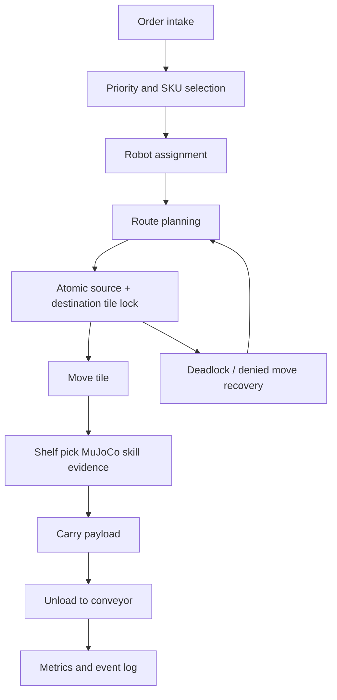

# Project Name

Agentic Warehouse Quadbot Fulfillment Simulator

# Overview

This project is a warehouse-order-fulfillment simulation built for the FFAI Robothon 2026 judging rubric. It combines a discrete multi-robot warehouse runtime with MuJoCo evidence clips for the low-level AEGIS quadruped actions that the runtime assumes.

The project is intentionally layered:

Mission -> Workflow -> Skill Graph -> Runtime -> Multi-Agent Warehouse Optimization -> MuJoCo Evidence -> Mission Control UI

# Judge-Facing Thesis

This submission is best read as a warehouse optimization benchmark with MuJoCo-backed robot skills, not as a single action demo. A single relay or handoff proves one local physical event. This project measures whether a shared warehouse stays productive when 9 quadrupeds compete for orders, racks, tile locks, priority, and narrow aisles over long simulated horizons.

The important claim is measurable: planner-off versus local-planner baselines show throughput uplift, wait-time reduction, and zero movement safety violations across generated load profiles and the 27-scenario accelerated stress benchmark.

# Problem Statement

Warehouse throughput depends on more than one robot successfully moving a parcel. A practical system must coordinate many robots, reserve space, avoid rack collisions, handle congestion, prioritize orders, and still prove that low-level robot actions are physically plausible. This submission targets that full stack while keeping MuJoCo focused on physical validation.

# System-Level Difficulty

The hard part is not only whether one robot can pick one parcel. The hard part is whether many robots can make simultaneous decisions inside the same constrained warehouse. Every assignment consumes a robot, every route consumes future tiles, every wait increases order age, and every shortcut can create congestion for another robot.

This makes the benchmark closer to warehouse traffic control than to a single manipulation clip. The runtime must keep four things true at the same time: orders keep completing, urgent work is not starved, robots do not collide or overlap locks, and the system still improves throughput under load.

# Robot Platform

The robot platform is the Faraday Future AEGIS quadruped using `assets/Aegis/urdf/Aegis_mujoco.urdf`. The warehouse version adds a BASE_LINK-mounted basket and a Futurist-derived front manipulator based on the FF Futurist right-arm chain and STL meshes.

# Environment

The runtime warehouse is a 20 x 14 discrete tile grid. Rack footprint tiles are hard obstacles. Service tiles sit beside racks, depot tiles seed robot starts, and outbound tiles represent conveyor dropoff. Movement is four-directional only.

# Task Description

Robots fulfill outbound orders by selecting rack tasks, reserving tile movement, navigating to service tiles, executing shelf pickup, carrying SKU payloads, unloading to outbound conveyors, and recovering from congestion. SKU weight and difficulty change load behavior and service time.

# Agentic Workflow Design

In plain terms, the agentic loop is: new orders arrive, the scheduler ranks them, a robot is chosen, the route reserves shared tiles, blocked moves trigger waiting or recovery, and the benchmark updates throughput and congestion. The planner is therefore judged by system behavior, not by a single isolated motion.

# Benchmark Design

Three generated load profiles are included: low, medium, and high. Each run is 900 simulated ticks and writes a snapshot, metrics JSON, and JSONL event stream. The UI can switch between the generated profiles.

## Accelerated Fleet Stress Benchmark

For long-horizon optimization evidence, the submission also includes a benchmark-only fast-forward runtime. It uses 1-minute ticks to simulate six warehouse hours per scenario without UI rendering. The 27-scenario matrix covers 3 load levels, 3 SKU weight mixes, and 3 pick difficulty levels. Each scenario runs planner-off and local-planner modes, producing 54 paired runs and 1,458 simulated robot-hours in about 3.1 wall-clock seconds.

Headline stress result: 100% safety pass rate, 0 collision violations, 0 tile-lock overlap violations, +31.72% average planner throughput uplift, and +93.99% best-case uplift under high-load congestion.

## Baseline Comparison

The deterministic medium benchmark includes a planner-off baseline and a local-planner result. Planner-off completes 72 of 84 orders at 288 orders/hour with 120.06 average completion ticks. Local route-window reservation completes 81 of 84 orders at 324 orders/hour with 42.30 average completion ticks. That is +12.5% throughput and -64.8% average completion time while keeping blocked-tile, route-cardinality, collision, and lock-overlap violations at 0.

# Metrics

| Load | Created | Completed | Active | Throughput | Avg completion | Avg lock wait | Utilization | Violations |
| --- | ---: | ---: | ---: | ---: | ---: | ---: | ---: | ---: |
| Low | 27 | 25 | 2 | 100/hr | 36.36 | 3.44 | 13.4% | 0 |
| Medium | 84 | 81 | 3 | 324/hr | 42.30 | 41.78 | 48.4% | 0 |
| High | 140 | 124 | 16 | 496/hr | 63.29 | 120.67 | 77.4% | 0 |

Tracked safety counters: blocked-tile route violations, route cardinality violations, robot collisions, and lock overlap violations.

# Core Features

- Multi-robot tile-level warehouse runtime
- Atomic current+next tile lock contract
- Rack footprint blocking
- Deadlock recovery and replanning counters
- SKU weight/difficulty model
- Runtime snapshots, metrics, and event streams
- Mission-control dashboard with runtime-linked robot animation
- MuJoCo evidence clips for walking, payload carrying, shelf pickup, and handoff

# Technical Architecture

- `warehouse_runtime/`: scheduler, state machine, movement lock model, metrics
- `configs/`: runtime, mission layout, scheduler policy, skill graph, benchmark settings
- `schemas/`: warehouse/order/robot data contracts
- `submissions/warehouse_quadbot_atomic_demos/mujoco_*`: MuJoCo validation modules
- `submissions/warehouse_quadbot_atomic_demos/ui/`: static dashboard UI
- `submissions/warehouse_quadbot_atomic_demos/outputs/`: generated runtime and video artifacts

# Results

The current medium profile completes 81 of 84 orders and reaches 324 orders/hour. High load completes 124 of 140 orders and reaches 496 orders/hour while preserving zero collision and zero lock-overlap violations. The accelerated fleet stress benchmark adds 27 six-hour scenarios with 100% safety pass rate and +31.72% average planner throughput uplift. MuJoCo evidence clips include contact counters for package/gripper, package/basket, package/shelf, and handoff interactions.

# Current Limitations

- Final 1-3 minute demo video is included as `demo.mp4`.
- Route-window reservation improves planner throughput, but the next step is learning lane direction and handoff timing policies instead of using a fixed reservation factor.
- Full fleet movement is tile-simulated; MuJoCo is used for atomic skill validation rather than continuous simulation of every warehouse robot.
- Optional OpenAI planner mode is not required for default judging and depends on external API credentials.

# Future Work

- Learn lane direction, handoff timing, and congestion pricing policies from multiple benchmark seeds.
- Add randomized benchmark seeds and multiple warehouse layouts.
- Stream live runtime events to the dashboard.
- Add more detailed MuJoCo contact validation for full shelf-to-basket manipulation.
