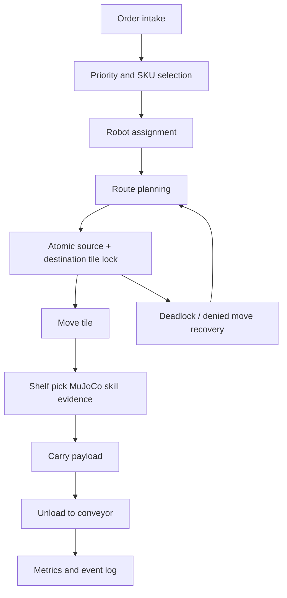

# Project Name

Agentic Warehouse Quadbot Fulfillment Simulator

# Overview

This project is a warehouse-order-fulfillment simulation built for the FFAI Robothon 2026 judging rubric. It combines a discrete multi-robot warehouse runtime with MuJoCo evidence clips for the low-level AEGIS quadruped actions that the runtime assumes.

The project is intentionally layered:

Mission -> Workflow -> Skill Graph -> Runtime -> Multi-Agent Warehouse Optimization -> MuJoCo Evidence -> Mission Control UI

# Problem Statement

Warehouse throughput depends on more than one robot successfully moving a parcel. A practical system must coordinate many robots, reserve space, avoid rack collisions, handle congestion, prioritize orders, and still prove that low-level robot actions are physically plausible. This submission targets that full stack while keeping MuJoCo focused on physical validation.

# Robot Platform

The robot platform is the Faraday Future AEGIS quadruped using `assets/Aegis/urdf/Aegis_mujoco.urdf`. The warehouse version adds a BASE_LINK-mounted basket and a Futurist-derived front manipulator based on the FF Futurist right-arm chain and STL meshes.

# Environment

The runtime warehouse is a 20 x 14 discrete tile grid. Rack footprint tiles are hard obstacles. Service tiles sit beside racks, depot tiles seed robot starts, and outbound tiles represent conveyor dropoff. Movement is four-directional only.

# Task Description

Robots fulfill outbound orders by selecting rack tasks, reserving tile movement, navigating to service tiles, executing shelf pickup, carrying SKU payloads, unloading to outbound conveyors, and recovering from congestion. SKU weight and difficulty change load behavior and service time.

# Agentic Workflow Design

# Benchmark Design

Three generated load profiles are included: low, medium, and high. Each run is 900 simulated ticks and writes a snapshot, metrics JSON, and JSONL event stream. The UI can switch between the generated profiles.

# Metrics

| Load | Created | Completed | Active | Throughput | Avg completion | Avg lock wait | Utilization | Violations |
| --- | ---: | ---: | ---: | ---: | ---: | ---: | ---: | ---: |
| Low | 27 | 24 | 3 | 96/hr | 80.21 | 9.78 | 28.8% | 0 |
| Medium | 84 | 72 | 12 | 288/hr | 120.06 | 82.44 | 84.5% | 0 |
| High | 140 | 68 | 72 | 272/hr | 140.53 | 85.78 | 85.0% | 0 |

Tracked safety counters: blocked-tile route violations, route cardinality violations, robot collisions, and lock overlap violations.

# Core Features

- Multi-robot tile-level warehouse runtime
- Atomic current+next tile lock contract
- Rack footprint blocking
- Deadlock recovery and replanning counters
- SKU weight/difficulty model
- Runtime snapshots, metrics, and event streams
- Mission-control dashboard with runtime-linked robot animation
- MuJoCo evidence clips for walking, payload carrying, shelf pickup, and handoff

# Technical Architecture

- `warehouse_runtime/`: scheduler, state machine, movement lock model, metrics
- `configs/`: runtime, mission layout, scheduler policy, skill graph, benchmark settings
- `schemas/`: warehouse/order/robot data contracts
- `submissions/warehouse_quadbot_atomic_demos/mujoco_*`: MuJoCo validation modules
- `submissions/warehouse_quadbot_atomic_demos/ui/`: static dashboard UI
- `submissions/warehouse_quadbot_atomic_demos/outputs/`: generated runtime and video artifacts

# Results

The current medium profile completes 72 of 84 orders and reaches 288 orders/hour. High load produces congestion pressure while preserving zero collision and zero lock-overlap violations. MuJoCo evidence clips include contact counters for package/gripper, package/basket, package/shelf, and handoff interactions.

# Current Limitations

- Final 1-3 minute demo video is included as `demo.mp4`.
- Planner-off and local-planner medium benchmarks currently produce equal throughput in the deterministic 900-tick scenario.
- Full fleet movement is tile-simulated; MuJoCo is used for atomic skill validation rather than continuous simulation of every warehouse robot.
- Optional OpenAI planner mode is not required for default judging and depends on external API credentials.

# Future Work

- Tune the AI planner to outperform the planner-off baseline.
- Add randomized benchmark seeds and multiple warehouse layouts.
- Stream live runtime events to the dashboard.
- Add more detailed MuJoCo contact validation for full shelf-to-basket manipulation.
