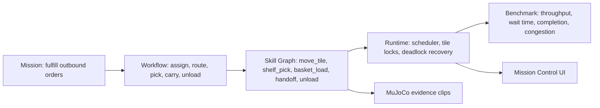

# Agentic Warehouse Quadbot Fulfillment Simulator

Agentech's Robothon 2026 entry is a warehouse-order-fulfillment simulator built around a fleet of AEGIS quadruped robots. The project connects mission design, workflow, skill graph, runtime scheduling, tile-lock movement, benchmark metrics, MuJoCo low-level action evidence, and a mission-control dashboard.

This is not a low-level robot teleoperation project. MuJoCo is used as the physical-world validator for atomic robot actions such as walking with different payloads, shelf pickup, basket loading, and robot-to-robot handoff.

## Demo Video

Final 1-3 minute demo video: [`demo.mp4`](demo.mp4).

The final demo video is included directly in this submission as `demo.mp4` (1:05.97, 720p H.264/AAC, 9.8 MB). Existing evidence clips are also included and can be reviewed separately:

- MuJoCo contact sheet: `outputs/physics_evidence/physics_evidence_contact_sheet.png`
- Atomic action preview sheet: `outputs/preview_contact_sheet.png`
- Runtime dashboard: serve `ui/index.html` over HTTP as described below
- MuJoCo MP4 clips: `outputs/physics_evidence/*.mp4` and `outputs/*.mp4`


Submission support documents:

- `SUBMISSION_MANIFEST.md`: maps the judge-facing submission to repo-root runtime/config/schema code.
- `VALIDATION_REPORT.md`: records clean-copy validation and artifact hygiene checks.
- `DEMO_VIDEO_SCRIPT.md`: capture plan for the final 1-3 minute video.
- `SUBMISSION_CHECKLIST.md`: final PR readiness checklist.

## Why This Project Matters

Warehouse robots are useful only when physical actions and fleet-level decisions agree. A single robot can pick a parcel, but an order-fulfillment system must also decide which robot moves, which tile is reserved, which shelf is picked, how congestion is avoided, and whether throughput improves under load.

This submission demonstrates that bridge:

- AEGIS quadruped robot actions are validated in MuJoCo.
- Warehouse movement is modeled as a discrete tile world.
- Orders, shelves, robots, movement locks, congestion, and completion metrics are tracked by the runtime.
- A mission-control UI explains the result to AI judges without requiring extra context.

## Benchmark Overview

The benchmark runs a 20 x 14 tile warehouse with 9 robots, rack footprint blocking, depot/service/outbound tiles, three SKU weight classes, and three load profiles.

| Load | Created | Completed | Active | Throughput | Avg completion | Avg lock wait | Robot util. | Safety violations |
| --- | ---: | ---: | ---: | ---: | ---: | ---: | ---: | ---: |
| Low | 27 | 24 | 3 | 96/hr | 80.21 ticks | 9.78 ticks | 28.8% | 0 |
| Medium | 84 | 72 | 12 | 288/hr | 120.06 ticks | 82.44 ticks | 84.5% | 0 |
| High | 140 | 68 | 72 | 272/hr | 140.53 ticks | 85.78 ticks | 85.0% | 0 |

Safety violations include blocked-rack route violations, non-cardinal route steps, robot-tile collisions, and tile-lock overlap violations. All are zero in the generated low/medium/high snapshots.

## Agentic Workflow



## Baseline Comparison

The current deterministic 900-tick medium-load comparison shows the same throughput for `--planner off` and `--planner local`; the local planner still records planner checks and exposes the contract for future AI planning. The measurable value in this version is the runtime safety contract and presentation pipeline rather than a tuned throughput uplift.

| Mode | Completed | Throughput | Planner checks | Collision violations | Lock overlap violations |
| --- | ---: | ---: | ---: | ---: | ---: |
| Planner off | 72 / 84 | 288/hr | 0 | 0 | 0 |
| Local planner | 72 / 84 | 288/hr | 2 | 0 | 0 |

This is listed as a current limitation and a future optimization target.

## Environment

- 20 x 14 discrete warehouse tile grid
- N/S/E/W movement only, no diagonal moves
- Rack footprint tiles are hard obstacles
- Robots reserve current tile + destination tile before moving
- SKU classes: cardboard/light, wood/medium, metal/heavy
- Load profiles: low, medium, high
- Outbound service tiles and conveyor zones

## Robot Platform

- Base robot: Faraday Future AEGIS quadruped, using `assets/Aegis/urdf/Aegis_mujoco.urdf`
- Warehouse accessory: BASE_LINK-mounted basket
- Manipulator reference: FF Futurist right-arm chain, using `assets/Futurist/futurist.urdf` and right-arm/right-hand STL meshes
- MuJoCo evidence: leg joints, arm joints, gripper slide joints, collision geoms, touch sensors, and position actuators

## Metrics

The runtime writes JSON and JSONL outputs in `outputs/`:

- `runtime_snapshot_{low,medium,high}.json`
- `benchmark_metrics_{low,medium,high}.json`
- `runtime_events_{low,medium,high}.jsonl`

Primary metrics:

- Throughput: completed orders per simulated hour
- Completion rate: completed / created orders
- Wait time: average tile-lock wait ticks
- Congestion: deadlock recoveries, replans, denied moves, active queue
- Safety: blocked-tile, cardinal-route, collision, and lock-overlap violations

## Results

- Medium load reaches 288 orders/hour with 72 of 84 orders completed in 900 simulated seconds.
- High load stress test keeps all movement safety counters at 0 while exposing queue pressure and congestion.
- MuJoCo clips show payload-dependent gait, shelf pickup, basket contact, and heavy-package handoff.
- The UI binds to generated runtime JSON and animates runtime-linked robot movement without closing open routes or using mock-only phase motion.

## Installation

Requires Python 3.12 or newer. On macOS, avoid the system Python 3.9 because current MuJoCo wheels are resolved cleanly with Python 3.12.

From the repository root:

```bash
python3.12 -m venv .venv
source .venv/bin/activate
python -m pip install -r requirements.txt
```

If a Python 3.12 environment already exists, it can be used instead.

## Run

Generate integrated runtime data for the dashboard:

```bash
python examples/build_integrated_demo_data.py
```

Run a benchmark from the command line:

```bash
python examples/run_warehouse_runtime.py --load medium --planner local --ticks 900 --print-summary
```

Run the MuJoCo atomic evidence generator:

```bash
python submissions/warehouse_quadbot_atomic_demos/run_quadbot_atomic_demos.py --scenario all
```

Run one MuJoCo clip only:

```bash
python submissions/warehouse_quadbot_atomic_demos/run_quadbot_atomic_demos.py --scenario shelf_pick_metal
```

Serve the dashboard over HTTP so browser `fetch()` can read runtime JSON:

```bash
python -m http.server 8765 --bind 127.0.0.1
```

Open:

```text
http://127.0.0.1:8765/submissions/warehouse_quadbot_atomic_demos/ui/index.html
```

## Controls

The dashboard exposes:

- Load profile: low, medium, high
- Playback speed: 10x, 60x
- Pause / next tick / reset
- Runtime status, order intake, robot modules, tile locks, KPI badges, and MuJoCo evidence panels

## Directory Structure

```text
submissions/warehouse_quadbot_atomic_demos/
  README.md
  PROJECT_WRITEUP.md
  PR_DESCRIPTION.md
  demo.mp4
  SUBMISSION_MANIFEST.md
  VALIDATION_REPORT.md
  DEMO_VIDEO_SCRIPT.md
  SUBMISSION_CHECKLIST.md
  registration.json
  run_quadbot_atomic_demos.py
  mujoco_minimal/
  mujoco_physics_evidence/
  outputs/
    runtime_snapshot_*.json
    benchmark_metrics_*.json
    runtime_events_*.jsonl
    physics_evidence/*.mp4
    physics_evidence/generated_mjcf/*.xml
  ui/
    index.html
    app.js
    styles.css
    sprites/
  docs/screenshots/
```

## Limitations

- The current planner-off and local-planner 900-tick medium benchmark have equal throughput; planner tuning remains future work.
- MuJoCo validates atomic actions and contact evidence, but the warehouse runtime is a tile-level simulator, not a full continuous physics simulation of all fleet movement.
- Optional OpenAI planner mode requires judge-provided `OPENAI_API_KEY` and `OPENAI_MODEL`; default judging path uses local planner mode.

## Future Improvements

- Tune AI planner policy to improve throughput versus planner-off baseline.
- Add live backend streaming instead of static JSON snapshots.
- Expand benchmark scenarios with randomized orders and multiple warehouse layouts.
- Add stronger packaging automation for PR submission and artifact validation.
