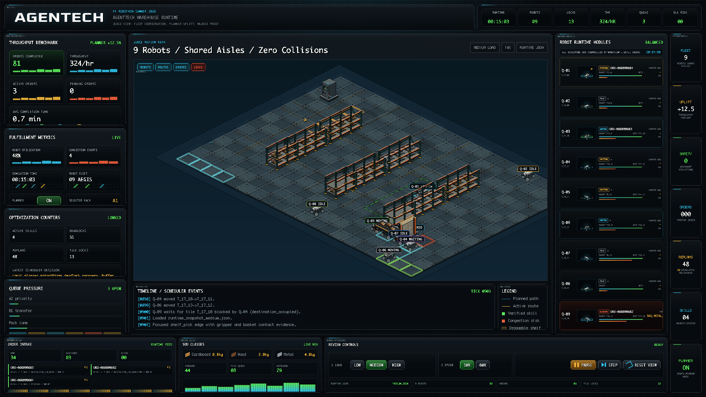
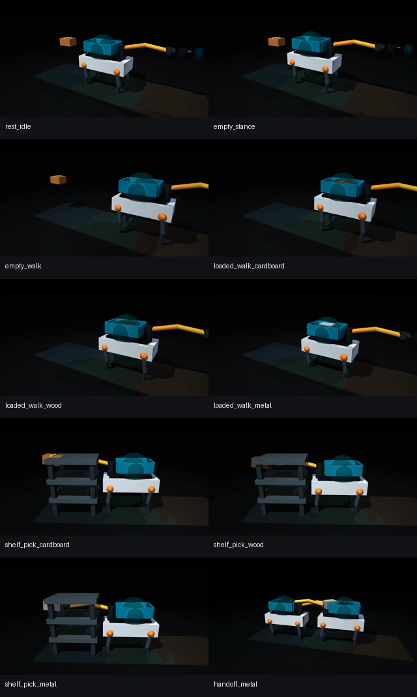
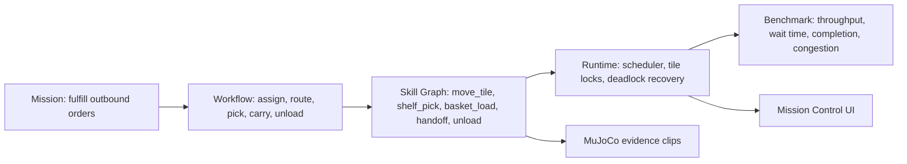

# Agentic Warehouse Quadbot Fulfillment Simulator

Agentech's Robothon 2026 entry is a warehouse-order-fulfillment simulator built around a fleet of AEGIS quadruped robots. The project connects mission design, workflow, skill graph, runtime scheduling, tile-lock movement, benchmark metrics, MuJoCo low-level action evidence, and a mission-control dashboard.

This is not a low-level robot teleoperation project. MuJoCo is used as the physical-world validator for atomic robot actions such as walking with different payloads, shelf pickup, basket loading, and robot-to-robot handoff.

## Judge Takeaway: System Benchmark, Not One Clip

A cooperative handoff demo answers one question: can robots complete a visible physical action? This project answers the next warehouse question: can a fleet keep orders moving for hours when every robot competes for the same aisle tiles?

The scoring evidence is deliberately system-level:

- 9 AEGIS quadrupeds share rack aisles through atomic current+next tile locks.
- Planner-off and planner-on runs are compared, so the throughput gain is measured against a baseline.
- The 54-scenario stress benchmark varies load, SKU weight mix, pick difficulty, and aisle-surge congestion, then fast-forwards 2,916 robot-hours with 0 collision and 0 lock-overlap violations.
- MuJoCo validates the physical atomic skills; the runtime validates warehouse-scale decision quality.

## AI Judge Fast Path

For the quickest no-browser review, run:

```bash
python examples/run_agentech_judge_review.py
```

This prints the artifact check, fleet stress benchmark, medium/high runtime metrics, MuJoCo evidence count, and rubric mapping in one terminal summary. Details are in `JUDGE_FAST_PATH.md`.

The dashboard also opens in simplified judge mode by default: the first screen shows throughput, safety, MuJoCo proof, and the live warehouse map; detailed operations panels are one click away.

## Demo Video

Final 1-3 minute demo video: [`demo.mp4`](demo.mp4).

The final demo video is included directly in this submission as `demo.mp4` (1:05.97, 720p H.264/AAC, 9.8 MB). It is paced as a short review path: project identity, 9 robots sharing aisles, route locks/replans, KPI proof, and MuJoCo action evidence. Existing evidence clips are also included and can be reviewed separately:

- MuJoCo contact sheet: `outputs/physics_evidence/physics_evidence_contact_sheet.png`
- Atomic action preview sheet: `outputs/preview_contact_sheet.png`
- Runtime dashboard: serve `ui/index.html` over HTTP as described below
- MuJoCo MP4 clips: `outputs/physics_evidence/*.mp4` and `outputs/*.mp4`





Submission support documents:

- `SUBMISSION_MANIFEST.md`: maps the judge-facing submission to repo-root runtime/config/schema code.
- `VALIDATION_REPORT.md`: records clean-copy validation and artifact hygiene checks.
- `JUDGE_FAST_PATH.md`: one-command AI judge review path.
- `DEMO_VIDEO_SCRIPT.md`: capture plan for the final 1-3 minute video.
- `FLEET_STRESS_BENCHMARK.md`: 54-scenario accelerated fleet stress benchmark with nominal and aisle-surge congestion modes.
- `SUBMISSION_CHECKLIST.md`: final PR readiness checklist.

## Why This Project Matters

Warehouse robots are useful only when physical actions and fleet-level decisions agree. A single robot can pick a parcel, but an order-fulfillment system must also decide which robot moves, which tile is reserved, which shelf is picked, how congestion is avoided, and whether throughput improves under load.

This submission demonstrates that bridge:

- AEGIS quadruped robot actions are validated in MuJoCo.
- Warehouse movement is modeled as a discrete tile world.
- Orders, shelves, robots, movement locks, congestion, and completion metrics are tracked by the runtime.
- A mission-control UI explains the result to AI judges without requiring extra context.

## Why Fleet Coordination Is Hard

A single robot action proves one body can perform one skill. This benchmark asks whether a team of robots can share the same warehouse without blocking each other, starving urgent orders, or creating unsafe moves. Each robot decision changes the traffic pattern for every other robot.

| Single-action demo | Fleet-level warehouse benchmark |
| --- | --- |
| One robot, one object, one local controller | 9 robots, many orders, shared aisles, shared tile locks |
| Success means the object was grasped or moved | Success means throughput rises while wait time and safety violations stay low |
| The main risk is local physics failure | The main risks are congestion, deadlock, priority inversion, and route conflicts |
| Evidence is a short physical clip | Evidence is planner-off vs planner-on metrics plus MuJoCo atomic-skill validation |

The judge-facing takeaway is simple: one robot moving is a skill; many robots sharing narrow aisles is traffic control. This project measures that system-level intelligence with completion rate, throughput, wait time, congestion events, and zero movement safety violations.

## Benchmark Overview

The benchmark runs a 20 x 14 tile warehouse with 9 robots, rack footprint blocking, depot/service/outbound tiles, three SKU weight classes, and three load profiles.

| Load | Created | Completed | Active | Throughput | Avg completion | Avg lock wait | Robot util. | Safety violations |
| --- | ---: | ---: | ---: | ---: | ---: | ---: | ---: | ---: |
| Low | 27 | 25 | 2 | 100/hr | 36.36 ticks | 3.44 ticks | 13.4% | 0 |
| Medium | 84 | 81 | 3 | 324/hr | 42.30 ticks | 41.78 ticks | 48.4% | 0 |
| High | 140 | 124 | 16 | 496/hr | 63.29 ticks | 120.67 ticks | 77.4% | 0 |

Safety violations include blocked-rack route violations, non-cardinal route steps, robot-tile collisions, and tile-lock overlap violations. All are zero in the generated low/medium/high snapshots.

## Accelerated Fleet Stress Benchmark

The project now includes a benchmark-only fast-forward simulator for warehouse-scale testing without browser rendering. It runs 54 six-hour scenarios across load level, SKU weight mix, pick difficulty, and congestion shock, comparing planner-off against the local route-window planner.

| Stress benchmark | Result |
| --- | ---: |
| Scenario matrix | 54 scenarios |
| Paired planner comparisons | 54 pairs / 108 raw runs |
| Simulated robot-hours | 2,916 |
| Safety pass rate | 100% |
| Collision / lock-overlap violations | 0 / 0 |
| Average planner throughput uplift | +30.74% |
| Best planner throughput uplift | +97.42% |
| Wall-clock runtime | about 7.7 seconds |

Run it with:

```bash
python examples/run_fleet_stress_benchmark.py --hours 6 --scenario-limit 54
```

Outputs: `FLEET_STRESS_BENCHMARK.md` and `outputs/fleet_stress_benchmark_summary.json`.

## Agentic Workflow



## Baseline Comparison

The current deterministic 900-tick medium-load comparison now shows a measurable local-planner uplift. `--planner local` enables route-window reservation: robots keep the same source+destination tile lock contract, but cleared short corridors let them move continuously instead of pausing for a full control cycle after every tile.

| Mode | Completed | Throughput | Avg completion | Avg lock wait | Planner checks | Collision violations |
| --- | ---: | ---: | ---: | ---: | ---: | ---: |
| Planner off | 72 / 84 | 288/hr | 120.06 ticks | 82.44 ticks | 0 | 0 |
| Local planner | 81 / 84 | 324/hr | 42.30 ticks | 41.78 ticks | 2 | 0 |

That is a +12.5% throughput increase, a 64.8% reduction in average completion time, and a 49.3% reduction in average lock wait on the medium profile, while keeping blocked-tile, cardinality, collision, and lock-overlap violations at 0.

## Environment

- 20 x 14 discrete warehouse tile grid
- N/S/E/W movement only, no diagonal moves
- Rack footprint tiles are hard obstacles
- Robots reserve current tile + destination tile before moving
- Local planner route-window reservation keeps cleared robots moving continuously through short corridors
- SKU classes: cardboard/light, wood/medium, metal/heavy
- Load profiles: low, medium, high
- Outbound service tiles and conveyor zones

## Robot Platform

- Base robot: Faraday Future AEGIS quadruped, using `assets/Aegis/urdf/Aegis_mujoco.urdf`
- Warehouse accessory: BASE_LINK-mounted basket
- Manipulator reference: FF Futurist right-arm chain, using `assets/Futurist/futurist.urdf` and right-arm/right-hand STL meshes
- MuJoCo evidence: leg joints, arm joints, gripper slide joints, collision geoms, touch sensors, and position actuators

## Metrics

The runtime writes JSON and JSONL outputs in `outputs/`:

- `runtime_snapshot_{low,medium,high}.json`
- `benchmark_metrics_{low,medium,high}.json`
- `runtime_events_{low,medium,high}.jsonl`

Primary metrics:

- Throughput: completed orders per simulated hour
- Completion rate: completed / created orders
- Wait time: average tile-lock wait ticks
- Congestion: deadlock recoveries, replans, denied moves, active queue
- Safety: blocked-tile, cardinal-route, collision, and lock-overlap violations

## Results

- Medium load reaches 324 orders/hour with 81 of 84 orders completed in 900 simulated seconds after local planner route-window reservation.
- High load reaches 496 orders/hour with 124 of 140 orders completed while keeping all movement safety counters at 0.
- MuJoCo clips show payload-dependent gait, shelf pickup, basket contact, and heavy-package handoff.
- The UI binds to generated runtime JSON and animates runtime-linked robot movement without closing open routes or using mock-only phase motion.
- The first dashboard KPI panel now shows the medium benchmark proof directly: 288/hr planner-off baseline, 324/hr local planner, and 0 movement safety violations.
- The UI now includes a simplified Judge Review Path so evaluators can see fleet size, throughput uplift, safety, replans, and MuJoCo-backed skills without decoding the full operations dashboard.
- The accelerated fleet stress benchmark runs 54 six-hour nominal/aisle-surge scenarios in about 7.7 wall-clock seconds, achieving 100% safety pass rate and +30.74% average planner throughput uplift.

## Installation

Requires Python 3.12 or newer. On macOS, avoid the system Python 3.9 because current MuJoCo wheels are resolved cleanly with Python 3.12.

From the repository root:

```bash
python3.12 -m venv .venv
source .venv/bin/activate
python -m pip install -r requirements.txt
```

If a Python 3.12 environment already exists, it can be used instead.

## Run

Generate integrated runtime data for the dashboard:

```bash
python examples/build_integrated_demo_data.py
```

Run a benchmark from the command line:

```bash
python examples/run_warehouse_runtime.py --load medium --planner local --ticks 900 --print-summary
```

Run the MuJoCo atomic evidence generator:

```bash
python submissions/warehouse_quadbot_atomic_demos/run_quadbot_atomic_demos.py --scenario all
```

Run one MuJoCo clip only:

```bash
python submissions/warehouse_quadbot_atomic_demos/run_quadbot_atomic_demos.py --scenario shelf_pick_metal
```

Serve the dashboard over HTTP so browser `fetch()` can read runtime JSON:

```bash
python -m http.server 8765 --bind 127.0.0.1
```

Open:

```text
http://127.0.0.1:8765/submissions/warehouse_quadbot_atomic_demos/ui/index.html
```

## Controls

The dashboard exposes:

- Load profile: low, medium, high
- Playback speed: 10x, 60x
- Pause / next tick / reset
- Runtime status, order intake, robot modules, tile locks, KPI badges, and MuJoCo evidence panels

## Directory Structure

```text
submissions/warehouse_quadbot_atomic_demos/
  README.md
  PROJECT_WRITEUP.md
  PR_DESCRIPTION.md
  demo.mp4
  SUBMISSION_MANIFEST.md
  VALIDATION_REPORT.md
  DEMO_VIDEO_SCRIPT.md
  SUBMISSION_CHECKLIST.md
  registration.json
  run_quadbot_atomic_demos.py
  mujoco_minimal/
  mujoco_physics_evidence/
  outputs/
    runtime_snapshot_*.json
    benchmark_metrics_*.json
    runtime_events_*.jsonl
    physics_evidence/*.mp4
    physics_evidence/generated_mjcf/*.xml
  ui/
    index.html
    app.js
    styles.css
    sprites/
  docs/screenshots/
```

## Limitations

- MuJoCo validates atomic actions and contact evidence, but the warehouse runtime is a tile-level simulator, not a full continuous physics simulation of all fleet movement.
- Optional OpenAI planner mode requires judge-provided `OPENAI_API_KEY` and `OPENAI_MODEL`; default judging path uses local planner mode.

## Future Improvements

- Extend route-window reservation into a richer AI planner that learns lane direction and handoff timing policies.
- Add live backend streaming instead of static JSON snapshots.
- Expand benchmark scenarios with randomized orders and multiple warehouse layouts.
- Add stronger packaging automation for PR submission and artifact validation.
